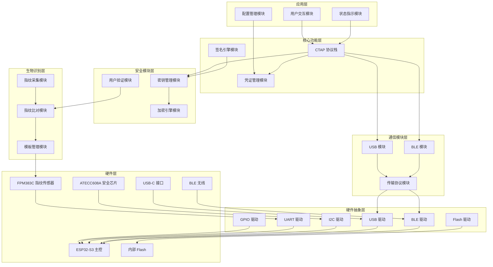

# IBio 系统架构设计文档（HLD）

**文档版本**：v1.0
**创建时间**：2026-04-06
**作者**：IBio 项目团队
**状态**：初稿

---

## 一、项目概述

### 1.1 项目背景

IBio 是一个开源的 FIDO2 安全密钥项目，旨在通过生物识别（指纹）验证增强身份认证的安全性。随着密码泄露事件频发和钓鱼攻击日益猖獗，无密码认证成为未来身份认证的主流方向。

FIDO2 标准由 FIDO Alliance 制定，包括：
- **WebAuthn**：W3C 制定的浏览器 API 标准
- **CTAP**：FIDO Alliance 制定的客户端与认证器通信协议

IBio 项目目标：
- 实现符合 FIDO2/CTAP2 标准的安全认证器
- 集成指纹生物识别验证
- 提供 USB + BLE 双模通信
- 实现低成本 DIY 方案（目标成本 $20-31）
- 开源硬件设计，便于社区复用

### 1.2 项目目标

| 目标类型 | 具体目标 | 验收标准 |
|----------|----------|----------|
| **功能目标** | FIDO2 认证器核心功能 | MakeCredential、GetAssertion 通过测试 |
| **安全目标** | 私钥不可导出、防篡改 | 通过 FIDO2 安全测试工具 |
| **性能目标** | 认证时间 < 2 秒 | 用户验证 + 签名完成 |
| **成本目标** | 硬件成本 < $31 | 核心硬件 + PCB 成本 |
| **开放目标** | 完全开源设计 | GitHub 公开所有设计文件 |

### 1.3 项目范围

**包含范围**：
- 硬件设计：PCB 设计文件、元件清单、组装指南
- 固件开发：FIDO2 协议实现、指纹集成、安全芯片驱动
- 测试验证：单元测试、FIDO2 认证测试
- 文档完善：设计文档、用户指南、开发指南

**不包含范围**：
- FIDO Alliance 官方认证（需付费）
- 大规模生产制造
- 企业级部署方案

---

## 二、整体架构图

### 2.1 系统层次架构

IBio 系统采用分层架构设计，从硬件层到应用层共分为五层：

```
┌─────────────────────────────────────────────────────────────────┐
│                        应用层（Application）                      │
│  ┌─────────────┐  ┌─────────────┐  ┌─────────────┐              │
│  │ 用户交互模块 │  │ 状态指示模块 │  │ 配置管理模块 │              │
│  └─────────────┘  └─────────────┘  └─────────────┘              │
├─────────────────────────────────────────────────────────────────┤
│                      核心功能层（Core Functions）                 │
│  ┌─────────────┐  ┌─────────────┐  ┌─────────────┐              │
│  │ CTAP 协议栈 │  │ 凭证管理模块 │  │ 签名引擎模块 │              │
│  └─────────────┘  └─────────────┘  └─────────────┘              │
├─────────────────────────────────────────────────────────────────┤
│                       安全模块层（Security）                      │
│  ┌─────────────┐  ┌─────────────┐  ┌─────────────┐              │
│  │ 密钥管理模块 │  │ 加密引擎模块 │  │ 用户验证模块 │              │
│  └─────────────┘  └─────────────┘  └─────────────┘              │
├─────────────────────────────────────────────────────────────────┤
│                     生物识别层（Biometric）                       │
│  ┌─────────────┐  ┌─────────────┐  ┌─────────────┐              │
│  │ 指纹采集模块 │  │ 指纹比对模块 │  │ 模板管理模块 │              │
│  └─────────────┘  └─────────────┘  └─────────────┘              │
├─────────────────────────────────────────────────────────────────┤
│                      通信模块层（Communication）                   │
│  ┌─────────────┐  ┌─────────────┐  ┌─────────────┐              │
│  │  USB 模块   │  │  BLE 模块   │  │ 传输协议模块 │              │
│  └─────────────┘  └─────────────┘  └─────────────┘              │
├─────────────────────────────────────────────────────────────────┤
│                    硬件抽象层（HAL - Hardware Abstraction）       │
│  ┌─────────────┐  ┌─────────────┐  ┌─────────────┐              │
│  │  GPIO 驱动  │  │  UART 驱动  │  │  I2C 驱动   │              │
│  └─────────────┘  └─────────────┘  └─────────────┘              │
│  ┌─────────────┐  ┌─────────────┐  ┌─────────────┐              │
│  │  USB 驱动   │  │  BLE 驱动   │  │  Flash 驱动 │              │
│  └─────────────┘  └─────────────┘  └─────────────┘              │
├─────────────────────────────────────────────────────────────────┤
│                       硬件层（Hardware）                          │
│  ┌───────────────────────────────────────────────────────────┐  │
│  │              ESP32-S3 主控芯片（核心处理单元）              │  │
│  └───────────────────────────────────────────────────────────┘  │
│  ┌─────────────┐  ┌─────────────┐  ┌─────────────┐              │
│  │ FPM383C 指纹 │  │ ATECC608A  │  │ USB-C 接口  │              │
│  │   传感器    │  │  安全芯片  │  │             │              │
│  └─────────────┘  └─────────────┘  └─────────────┘              │
└─────────────────────────────────────────────────────────────────┘
```

### 2.2 系统架构图（Mermaid）



### 2.3 系统组件关系图

| 组件 | 依赖组件 | 被依赖组件 |
|------|----------|------------|
| **CTAP 协议栈** | 密钥管理、凭证管理、签名引擎 | 用户交互、状态指示 |
| **密钥管理模块** | 加密引擎、安全芯片驱动 | CTAP 协议栈、签名引擎 |
| **凭证管理模块** | Flash 驱动 | CTAP 协议栈 |
| **签名引擎模块** | 加密引擎 | CTAP 协议栈 |
| **用户验证模块** | 指纹比对模块 | CTAP 协议栈 |
| **指纹采集模块** | UART 驱动 | 指纹比对模块 |
| **指纹比对模块** | 指纹采集、模板管理 | 用户验证模块 |
| **模板管理模块** | Flash 驱动 | 指纹比对模块 |

---

## 三、模块划分

### 3.1 硬件抽象层（HAL）

**职责**：提供统一的硬件访问接口，隔离硬件差异

| 模块 | 功能 | 接口 |
|------|------|------|
| **GPIO 驱动** | 通用 I/O 控制、中断处理 | `gpio_init()`, `gpio_read()`, `gpio_write()` |
| **UART 驱动** | 串口通信、指纹传感器接口 | `uart_init()`, `uart_read()`, `uart_write()` |
| **I2C 驱动** | I2C 总线、安全芯片接口 | `i2c_init()`, `i2c_read()`, `i2c_write()` |
| **USB 驱动** | USB HID 设备、CTAP over USB | `usb_init()`, `usb_send()`, `usb_recv()` |
| **BLE 驱动** | BLE GATT 服务、CTAP over BLE | `ble_init()`, `ble advertise()`, `ble_send()` |
| **Flash 驱动** | 内部 Flash、凭证存储 | `flash_read()`, `flash_write()`, `flash_erase()` |

### 3.2 核心功能层（CTAP 协议实现）

**职责**：实现 CTAP2.0/2.1 协议核心功能

| 模块 | 功能 | CTAP 命令 |
|------|------|----------|
| **CTAP 协议栈** | CTAP 消息解析、命令处理、响应生成 | 所有 CTAP 命令 |
| **凭证管理模块** | 凭证创建、存储、检索、删除 | MakeCredential, GetAssertion, CredentialManagement |
| **签名引擎模块** | ES256 签名、挑战验证 | GetAssertion |

**CTAP 协议栈详细设计**：

| CTAP 命令 | 命令字节 | 功能 | 模块调用 |
|-----------|----------|------|----------|
| **MakeCredential** | 0x01 | 创建新凭证 | 凭证管理 + 密钥管理 + 签名引擎 |
| **GetAssertion** | 0x02 | 获取认证签名 | 凭证管理 + 用户验证 + 签名引擎 |
| **GetInfo** | 0x04 | 返回认证器信息 | CTAP 协议栈（内部） |
| **ClientPIN** | 0x06 | PIN 管理 | 加密引擎 + 密钥管理 |
| **Reset** | 0x07 | 重置认证器 | 凭证管理 + 模板管理 |
| **GetNextAssertion** | 0x08 | 获取下一个断言 | 凭证管理 + 签名引擎 |
| **CredentialManagement** | 0x0A | 凭证枚举/删除 | 凭证管理 |
| **Selection** | 0x0B | 选择认证器 | CTAP 协议栈（内部） |

### 3.3 安全模块

**职责**：密钥存储、加密操作、用户验证

| 模块 | 功能 | 安全特性 |
|------|------|----------|
| **密钥管理模块** | 密钥生成、存储、检索 | 私钥不可导出、密钥隔离 |
| **加密引擎模块** | ES256 签名、ECDH 密钥协商、SHA-256 | 硬件加密加速 |
| **用户验证模块** | 指纹验证、PIN 验证 | 本地验证、防重放 |

**密钥管理模块详细设计**：

| 功能 | 实现方式 | 安全要求 |
|------|----------|----------|
| **密钥生成** | ATECC608A 硬件生成 | 密钥永不离开芯片 |
| **密钥存储** | ATECC608A 内部存储 | 16 个密钥槽位 |
| **密钥检索** | 密钥槽位索引 | 密钥 ID 映射表 |
| **密钥销毁** | 覆盖密钥槽位 | Reset 命令触发 |

**加密引擎模块详细设计**：

| 操作 | 算法 | 实现方式 |
|------|------|----------|
| **签名** | ES256 (ECDSA with SHA-256) | ATECC608A 硬件签名 |
| **密钥协商** | ECDH with P-256 | ATECC608A 硬件 ECDH |
| **哈希** | SHA-256 | ESP32-S3 總件加速或软件实现 |
| **PIN 加密** | AES-128 | ATECC608A 或 ESP32-S3 |

### 3.4 生物识别模块

**职责**：指纹采集、比对、模板管理

| 模块 | 功能 | 指纹操作 |
|------|------|----------|
| **指纹采集模块** | 指纹图像采集、图像预处理 | UART 命令发送、图像接收 |
| **指纹比对模块** | 特征提取、模板比对、匹配判断 | 1:1 比对、1:N 搜索 |
| **模板管理模块** | 指纹注册、模板存储、模板删除 | 模板 ID 管理 |

**指纹模块接口设计**：

| 接口 | 方向 | 数据格式 | 说明 |
|------|------|----------|------|
| **采集指令** | MCU → FPM383C | UART 包 | 触发指纹采集 |
| **图像数据** | FPM383C → MCU | UART 包 | 返回指纹图像 |
| **比对指令** | MCU → FPM383C | UART 包 + 模板 ID | 请求比对 |
| **比对结果** | FPM383C → MCU | UART 包 | 返回匹配分数 |
| **注册指令** | MCU → FPM383C | UART 包 | 触发指纹注册 |

**FPM383C 指纹传感器特性**：

| 特性 | 规格 |
|------|------|
| **传感器类型** | 电容式按压传感器 |
| **分辨率** | 192x192 像素 |
| **采集面积** | 10x10 mm |
| **模板容量** | 200 个指纹模板 |
| **误识率（FAR）** | < 0.001% (1/100,000) |
| **拒识率（FRR）** | < 2% |
| **匹配时间** | < 1 秒 |
| **接口** | UART (9600-115200 bps) |

### 3.5 通信模块

**职责**：USB/BLE 传输协议实现

| 模块 | 功能 | 协议 |
|------|------|------|
| **USB 模块** | USB HID 设备、CTAP over HID | USB HID 协议 |
| **BLE 模块** | BLE GATT 服务、CTAP over BLE | FIDO GATT 服务 |
| **传输协议模块** | CTAP 消息分片、重组、超时处理 | CTAP 传输绑定 |

**USB 传输详细设计**：

| 项目 | 规格 |
|------|------|
| **设备类型** | USB HID（Human Interface Device） |
| **端点类型** | Interrupt IN/OUT |
| **数据包大小** | 64 字节 |
| **传输协议** | CTAP over HID |
| **超时时间** | 30 秒（响应超时） |

**BLE 传输详细设计**：

| 项目 | 规格 |
|------|------|
| **BLE 版本** | BLE 5.0 |
| **GATT 服务** | FIDO Service (UUID: 0xFFFD) |
| **特征值** | Control Point, Status, Service Revision |
| **连接间隔** | 15-30 ms |
| **传输协议** | CTAP over BLE |

### 3.6 应用层

**职责**：用户交互、状态指示、配置管理

| 模块 | 功能 | 用户操作 |
|------|------|----------|
| **用户交互模块** | 触摸检测、指纹触发 | 用户触摸认证器 |
| **状态指示模块** | LED 状态指示、声音提示 | 状态可视化 |
| **配置管理模块** | 设备配置、固件更新 | 配置持久化 |

---

## 四、数据流设计

### 4.1 注册流程数据流

**场景**：用户首次注册 FIDO2 凭证

```
┌─────────┐     ┌─────────┐     ┌─────────┐     ┌─────────┐     ┌─────────┐
│  主机   │     │  USB/BLE│     │   CTAP  │     │ 安全模块│     │ 指纹模块│
│ (浏览器)│     │  传输   │     │  协议栈 │     │         │     │         │
└────┬────┘     └────┬────┘     └────┬────┘     └────┬────┘     └────┬────┘
     │               │               │               │               │
     │ WebAuthn API  │               │               │               │
     │ MakeCredential│               │               │               │
     │ Request       │               │               │               │
     ├──────────────>│               │               │               │
     │               │ CTAP CMD 0x01 │               │               │
     │               ├──────────────>│               │               │
     │               │               │ 解析请求      │               │
     │               │               ├──────────────>│               │
     │               │               │               │ 检查密钥槽位  │
     │               │               │               │ 是否可用      │
     │               │               │<──────────────│               │
     │               │               │ 请求用户验证  │               │
     │               │               ├──────────────────────────────>│
     │               │               │               │               │ 采集指纹
     │               │               │               │               │ 比对模板
     │               │               │               │               │ 返回结果
     │               │               │<──────────────────────────────│
     │               │               │ UV=1（验证成功）│               │
     │               │               ├──────────────>│               │
     │               │               │               │ 生成密钥对    │
     │               │               │               │ (ATECC608A)   │
     │               │               │               │ 存储私钥      │
     │               │               │<──────────────│               │
     │               │               │ 返回公钥      │               │
     │               │               │ 生成凭证 ID   │               │
     │               │               │ 存储凭证      │               │
     │               │               │ 生成 attestation│              │
     │               │               │ 签名 attestation│              │
     │               │<──────────────│               │               │
     │               │ CTAP Response │               │               │
     │<──────────────│               │               │               │
     │               │               │               │               │
```

### 4.2 认证流程数据流

**场景**：用户使用 FIDO2 凭证登录

```
┌─────────┐     ┌─────────┐     ┌─────────┐     ┌─────────┐     ┌─────────┐
│  主机   │     │  USB/BLE│     │   CTAP  │     │ 安全模块│     │ 指纹模块│
│ (浏览器)│     │  传输   │     │  协议栈 │     │         │     │         │
└────┬────┘     └────┬────┘     └────┬────┘     └────┬────┘     └────┬────┘
     │               │               │               │               │
     │ WebAuthn API  │               │               │               │
     │ GetAssertion  │               │               │               │
     │ Request       │               │               │               │
     ├──────────────>│               │               │               │
     │               │ CTAP CMD 0x02 │               │               │
     │               ├──────────────>│               │               │
     │               │               │ 解析请求      │               │
     │               │               │ 查找凭证      │               │
     │               │               │（allowList）  │               │
     │               │               │ 请求用户验证  │               │
     │               │               ├──────────────────────────────>│
     │               │               │               │               │ 等待触摸
     │               │               │               │               │ 采集指纹
     │               │               │               │               │ 比对模板
     │               │               │               │               │ 返回结果
     │               │               │<──────────────────────────────│
     │               │               │ UV=1（验证成功）│               │
     │               │               ├──────────────>│               │
     │               │               │               │ 检索私钥      │
     │               │               │               │ 签名挑战      │
     │               │               │               │ (ES256)       │
     │               │               │<──────────────│               │
     │               │               │ 返回签名结果  │               │
     │               │               │ 生成断言      │               │
     │               │<──────────────│               │               │
     │               │ CTAP Response │               │               │
     │<──────────────│               │               │               │
     │               │               │               │               │
```

### 4.3 指纹验证流程

**场景**：用户触摸认证器进行指纹验证

```
┌─────────┐     ┌─────────┐     ┌─────────┐     ┌─────────┐
│  用户   │     │   MCU   │     │指纹模块 │     │ 指纹库  │
│  手指   │     │(ESP32)  │     │(FPM383C)│     │ (Flash) │
└────┬────┘     └────┬────┘     └────┬────┘     └────┬────┘
     │               │               │               │
     │ 触摸传感器    │               │               │
     ├──────────────>│               │               │
     │               │ GPIO 中断     │               │
     │               │ 触发采集      │               │
     │               ├──────────────>│               │
     │               │               │ 采集指令      │
     │               │               │ 等待手指按下  │
     │ 触摸确认      │               │               │
     ├──────────────────────────────>│               │
     │               │               │ 指纹图像采集  │
     │               │               │ 特征提取      │
     │               │               │ 模板比对      │
     │               │               ├──────────────>│
     │               │               │ 加载模板      │
     │               │               │<──────────────│
     │               │               │ 比对计算      │
     │               │               │ 匹配判断      │
     │               │<──────────────│               │
     │               │ 返回结果      │               │
     │               │ (匹配/不匹配) │               │
     │               │               │               │
```

### 4.4 CTAP 消息处理流程

**场景**：CTAP 命令消息处理

```
┌─────────────────────────────────────────────────────────────────┐
│                    CTAP 消息处理流程                             │
└─────────────────────────────────────────────────────────────────┘

           接收 CTAP 消息
                  │
                  ▼
           ┌──────────────┐
           │ 解析消息头   │
           │ (Command Byte)│
           └──────────────┘
                  │
                  ▼
           ┌──────────────┐
           │ 解析 CBOR 参数│
           └──────────────┘
                  │
                  ▼
           ┌──────────────┐
           │ 命令分发     │
           │ MakeCredential│──────> 创建凭证流程
           │ GetAssertion  │──────> 认证签名流程
           │ GetInfo       │──────> 返回设备信息
           │ ClientPIN     │──────> PIN 管理流程
           │ Reset         │──────> 重置流程
           │ ...           │
           └──────────────┘
                  │
                  ▼
           ┌──────────────┐
           │ 执行命令     │
           │ 调用相关模块 │
           └──────────────┘
                  │
                  ▼
           ┌──────────────┐
           │ 生成响应     │
           │ (CBOR 编码)  │
           └──────────────┘
                  │
                  ▼
           ┌──────────────┐
           │ 返回响应     │
           │ (USB/BLE)    │
           └──────────────┘
```

---

## 五、接口定义

### 5.1 模块间接口

#### HAL 层接口

```c
// GPIO 驱动接口
typedef enum {
    GPIO_MODE_INPUT,
    GPIO_MODE_OUTPUT,
    GPIO_MODE_INTERRUPT
} gpio_mode_t;

int gpio_init(uint8_t pin, gpio_mode_t mode);
int gpio_read(uint8_t pin);
int gpio_write(uint8_t pin, uint8_t value);
int gpio_set_interrupt(uint8_t pin, void (*callback)(void));

// UART 驱动接口
typedef struct {
    uint32_t baudrate;
    uint8_t data_bits;
    uint8_t parity;
    uint8_t stop_bits;
} uart_config_t;

int uart_init(uint8_t port, uart_config_t *config);
int uart_read(uint8_t port, uint8_t *data, uint32_t len, uint32_t timeout);
int uart_write(uint8_t port, uint8_t *data, uint32_t len);

// I2C 驱动接口
typedef struct {
    uint8_t address;
    uint32_t frequency;
} i2c_config_t;

int i2c_init(uint8_t bus, i2c_config_t *config);
int i2c_read(uint8_t bus, uint8_t addr, uint8_t *data, uint32_t len);
int i2c_write(uint8_t bus, uint8_t addr, uint8_t *data, uint32_t len);

// Flash 驱动接口
int flash_read(uint32_t addr, uint8_t *data, uint32_t len);
int flash_write(uint32_t addr, uint8_t *data, uint32_t len);
int flash_erase(uint32_t addr, uint32_t len);
```

#### 安全模块接口

```c
// 密钥管理接口
typedef struct {
    uint8_t key_id;
    uint8_t key_type;  // ES256, RS256, EdDSA
    uint8_t slot_index;
} key_handle_t;

int key_generate(uint8_t key_type, key_handle_t *handle);
int key_get_public_key(key_handle_t *handle, uint8_t *pubkey, uint32_t *len);
int key_sign(key_handle_t *handle, uint8_t *data, uint32_t len, uint8_t *sig, uint32_t *sig_len);
int key_delete(key_handle_t *handle);

// 加密引擎接口
int crypto_sha256(uint8_t *data, uint32_t len, uint8_t *hash);
int crypto_ecdh(uint8_t *peer_pubkey, uint8_t *shared_secret);
int crypto_aes_encrypt(uint8_t *key, uint8_t *data, uint32_t len, uint8_t *encrypted);
int crypto_aes_decrypt(uint8_t *key, uint8_t *encrypted, uint32_t len, uint8_t *data);

// 用户验证接口
typedef enum {
    UV_NONE,      // 无验证
    UV_PIN,       // PIN 验证
    UV_FINGERPRINT // 指纹验证
} uv_method_t;

int uv_request(uv_method_t method);
int uv_get_result(uint8_t *success);
int uv_set_pin(uint8_t *pin, uint32_t len);
int uv_verify_pin(uint8_t *pin, uint32_t len);
```

#### 指纹模块接口

```c
// 指纹采集接口
int fp_capture_start(void);
int fp_capture_wait(uint8_t *image, uint32_t *len, uint32_t timeout);
int fp_capture_stop(void);

// 指纹比对接口
int fp_match(uint8_t template_id, uint8_t *match_score);
int fp_search(uint8_t *template_id, uint8_t *match_score);

// 模板管理接口
int fp_enroll_start(void);
int fp_enroll_add_image(uint8_t *image, uint32_t len, uint8_t *quality);
int fp_enroll_finish(uint8_t *template_id);
int fp_template_delete(uint8_t template_id);
int fp_template_list(uint8_t *list, uint32_t *count);
```

#### CTAP 协议栈接口

```c
// CTAP 命令处理接口
typedef struct {
    uint8_t command;
    uint8_t *params;
    uint32_t params_len;
} ctap_request_t;

typedef struct {
    uint8_t status;
    uint8_t *data;
    uint32_t data_len;
} ctap_response_t;

int ctap_process_request(ctap_request_t *req, ctap_response_t *resp);

// CTAP 命令定义
#define CTAP_CMD_MAKE_CREDENTIAL  0x01
#define CTAP_CMD_GET_ASSERTION    0x02
#define CTAP_CMD_GET_INFO         0x04
#define CTAP_CMD_CLIENT_PIN       0x06
#define CTAP_CMD_RESET            0x07
#define CTAP_CMD_GET_NEXT_ASSERTION 0x08
#define CTAP_CMD_CREDENTIAL_MANAGEMENT 0x0A
#define CTAP_CMD_SELECTION        0x0B

// CTAP 状态码
#define CTAP_STATUS_OK            0x00
#define CTAP_STATUS_ERR_INVALID_CMD 0x01
#define CTAP_STATUS_ERR_INVALID_PARAM 0x02
#define CTAP_STATUS_ERR_INVALID_LENGTH 0x03
#define CTAP_STATUS_ERR_PIN_INVALID 0x04
#define CTAP_STATUS_ERR_PIN_BLOCKED 0x05
#define CTAP_STATUS_ERR_UV_BLOCKED 0x06
```

### 5.2 硬件接口

#### ESP32-S3 与 FPM383C 连接

| ESP32-S3 引脚 | FPM383C 引脚 | 功能 |
|---------------|--------------|------|
| GPIO16 | TX | UART 发送 |
| GPIO17 | RX | UART 接收 |
| GPIO18 | EN | 传感器使能 |
| GPIO19 | TOUCH | 触摸检测 |
| 3.3V | VCC | 电源 |
| GND | GND | 地 |

#### ESP32-S3 与 ATECC608A 连接

| ESP32-S3 引脚 | ATECC608A 引脚 | 功能 |
|---------------|----------------|------|
| GPIO21 | SDA | I2C 数据线 |
| GPIO22 | SCL | I2C 时钟线 |
| GPIO23 | RST | 复位信号 |
| 3.3V | VCC | 电源 |
| GND | GND | 地 |

#### ESP32-S3 USB-C 接口

| ESP32-S3 引脚 | USB-C 连接器 | 功能 |
|---------------|--------------|------|
| USB_DP | D+ | USB 数据正 |
| USB_DN | D- | USB 数据负 |
| GPIO25 | CC1 | USB-C 配置通道 1 |
| GPIO26 | CC2 | USB-C 配置通道 2 |
| 5V | VBUS | USB 电源 |
| GND | GND | 地 |

### 5.3 通信接口

#### USB HID 接口

| 项目 | 值 |
|------|-----|
| **接口类型** | USB HID |
| **厂商 ID** | 待定（可使用测试 VID） |
| **产品 ID** | 待定 |
| **设备类** | 0x03 (HID) |
| **协议** | CTAP over HID |
| **端点** | Interrupt IN/OUT (64 bytes) |

#### BLE GATT 服务

| 项目 | UUID |
|------|------|
| **FIDO Service** | 0xFFFD |
| **FIDO Control Point** | FIDO Service + 0x01 |
| **FIDO Status** | FIDO Service + 0x02 |
| **FIDO Service Revision** | FIDO Service + 0x03 |

---

## 六、安全设计

### 6.1 密钥存储设计

**密钥存储架构**：

```
┌─────────────────────────────────────────────────────────────────┐
│                       密钥存储架构                               │
└─────────────────────────────────────────────────────────────────┐

┌─────────────┐     ┌─────────────┐     ┌─────────────┐
│ 凭证密钥    │     │ attestation │     │  PIN 密钥   │
│ (用户凭证)  │     │    密钥     │     │ (PIN 加密)  │
└─────────────┘     └─────────────┘     └─────────────┘
      │                   │                   │
      │                   │                   │
      ▼                   ▼                   ▼
┌─────────────────────────────────────────────────────────────────┐
│                   ATECC608A 安全芯片                              │
│  ┌─────────┐ ┌─────────┐ ┌─────────┐ ┌─────────┐ ┌─────────┐   │
│  │ Slot 0  │ │ Slot 1  │ │ Slot 2  │ │ Slot 3  │ │ ...     │   │
│  │ 凭证密钥│ │ 凭证密钥│ │ 凭证密钥│ │ 凭证密钥│ │         │   │
│  └─────────┘ └─────────┘ └─────────┘ └─────────┘ └─────────┘   │
│  ┌─────────┐ ┌─────────┐ ┌─────────┐                            │
│  │ Slot 14 │ │ Slot 15 │ │ 临时槽  │                            │
│  │attestation│ │ PIN密钥│ │ ECDH   │                            │
│  └─────────┘ └─────────┘ └─────────┘                            │
└─────────────────────────────────────────────────────────────────┘
```

**密钥槽位分配**：

| 槽位 | 用途 | 密钥类型 | 权限 |
|------|------|----------|------|
| **Slot 0-3** | 凭证密钥 | ES256 私钥 | 不可读、可签名 |
| **Slot 4-9** | 凭证密钥（扩展） | ES256 私钥 | 不可读、可签名 |
| **Slot 10-13** | 保留 | - | - |
| **Slot 14** | attestation 密钥 | ES256 私钥 | 不可读、可签名 |
| **Slot 15** | PIN 密钥 | ECDH 密钥 | 不可读、可 ECDH |

**密钥安全特性**：

| 特性 | 实现方式 |
|------|----------|
| **私钥不可导出** | ATECC608A 硬件保护 |
| **密钥隔离** | 每个凭证独立密钥槽位 |
| **密钥加密存储** | ATECC608A 内部加密 |
| **防侧信道攻击** | ATECC608A 硬件防护 |

### 6.2 防篡改设计

**固件安全设计**：

| 特性 | 实现方式 | 说明 |
|------|----------|------|
| **Secure Boot** | ESP32-S3 内置 | 启动时验证固件签名 |
| **Flash Encryption** | ESP32-S3 内置 | 固件加密存储 |
| **固件签名** | RSA/ECDSA | 固件更新签名验证 |
| **防调试** | 禁用 JTAG | 防止调试攻击 |

**物理安全设计**：

| 特性 | 实现方式 | 说明 |
|------|----------|------|
| **外壳封装** | 物理封装 | 防止物理访问 |
| **防拆检测** | GPIO 中断（可选） | 拆解触发密钥销毁 |
| **防电磁干扰** | PCB 设计 | 减少电磁泄露 |

### 6.3 用户验证设计

**PIN 验证设计**：

```
┌─────────────────────────────────────────────────────────────────┐
│                       PIN 验证流程                               │
└─────────────────────────────────────────────────────────────────┘

1. 客户端生成随机数 pinUvAuthToken
2. 客户端计算 pinHash = SHA256(PIN)[0:16]
3. 客户端请求认证器建立加密通道
4. 认证器生成临时公钥 pinUvAuthTokenPubKey
5. 双方计算共享密钥 K = ECDH(pinUvAuthTokenPubKey, ATECC608A_PinKey)
6. 客户端加密 pinHashEnc = AES(K, pinHash)
7. 认证器解密并验证 pinHashEnc
8. 验证成功返回 pinUvAuthToken
```

**指纹验证设计**：

| 特性 | 实现方式 |
|------|----------|
| **本地比对** | FPM383C 内置比对 |
| **模板加密** | FPM383C 内部存储（可选加密） |
| **模板不可导出** | FPM383C 禁止模板读取 |
| **防假指纹** | FPM383C 活体检测（可选） |
| **比对失败限制** | 连续失败锁定（CTAP UV Blocked） |

### 6.4 数据加密设计

**敏感数据加密**：

| 数据类型 | 加密方式 | 密钥来源 |
|----------|----------|----------|
| **PIN** | AES-128 | ECDH 共享密钥 |
| **凭证 ID** | 无加密（标识符） | - |
| **指纹模板** | FPM383C 内部加密 | FPM383A 内部密钥 |
| **私钥** | ATECC608A 内部加密 | ATECC608A 内部密钥 |

---

## 七、部署拓扑

### 7.1 硬件连接示意图

**IBio 硬件连接图**：

```
┌─────────────────────────────────────────────────────────────────┐
│                       IBio 硬件连接拓扑                           │
└─────────────────────────────────────────────────────────────────┘

                           USB-C 连接器
                               │
                    ┌──────────┴──────────┐
                    │        USB-BUS      │
                    │    (VBUS, D+, D-)   │
                    └─────────────────────┘
                               │
                    ┌──────────┴──────────┐
                    │      ESP32-S3       │
                    │     主控芯片        │
                    │                     │
                    │  ┌───────────────┐  │
                    │  │  Xtensa LX7   │  │
                    │  │  双核 240MHz  │  │
                    │  ├───────────────┤  │
                    │  │  USB OTG      │  │<────── USB HID
                    │  │  BLE 5.0      │  │<────── BLE GATT
                    │  │  Flash 8MB    │  │<────── 凭证存储
                    │  │  UART x3      │  │<────── 指纹接口
                    │  │  I2C x2       │  │<────── 安全芯片
                    │  │  GPIO         │  │<────── 触摸检测
                    │  └───────────────┘  │
                    └─────────────────────┘
                               │
          ┌────────────────────┼────────────────────┐
          │                    │                    │
          ▼                    ▼                    ▼
┌─────────────────┐  ┌─────────────────┐  ┌─────────────────┐
│   FPM383C       │  │   ATECC608A     │  │   LED 指示灯    │
│   指纹传感器     │  │   安全芯片      │  │   (状态指示)    │
│                 │  │                 │  │                 │
│  UART 接口      │  │  I2C 接口       │  │  GPIO 控制      │
│  电容式按压     │  │  EAL4+ 安全     │  │  RGB LED        │
│  192x192 像素   │  │  ES256 签名     │  │                 │
│  200 模板       │  │  16 密钥槽      │  │                 │
└─────────────────┘  └─────────────────┘  └─────────────────┘
```

### 7.2 PCB 布局建议

**PCB 尺寸建议**：

| 项目 | 建议值 |
|------|--------|
| **整体尺寸** | 50x30 mm（或更小） |
| **PCB 层数** | 2 层（双层板） |
| **板厚** | 1.6 mm |
| **表面处理** | ENIG（金手指） |

**元件布局建议**：

| 区域 | 元件 | 说明 |
|------|------|------|
| **中心区域** | ESP32-S3-WROOM-1 | 主控模块 |
| **上方区域** | USB-C 连接器 | USB 接口 |
| **左侧区域** | FPM383C 指纹传感器 | 指纹采集区 |
| **右侧区域** | ATECC608A 安全芯片 | 安全芯片 |
| **下方区域** | LED + 触摸检测 | 状态指示 |

### 7.3 电源设计

**电源架构**：

```
┌─────────────────────────────────────────────────────────────────┐
│                       电源架构                                   │
└─────────────────────────────────────────────────────────────────┘

USB-C VBUS (5V)
      │
      ▼
┌─────────────┐
│  LDO/DCDC   │
│  3.3V 输出  │
└─────────────┘
      │
      ├────────────────────┬────────────────────┬──────────────────┐
      │                    │                    │                  │
      ▼                    ▼                    ▼                  ▼
┌─────────────┐     ┌─────────────┐     ┌─────────────┐    ┌─────────────┐
│  ESP32-S3   │     │  FPM383C    │     │  ATECC608A  │    │    LED      │
│  主控芯片   │     │  指纹传感器 │     │  安全芯片   │    │   状态灯    │
│             │     │             │     │             │    │             │
│ 工作电流:   │     │ 工作电流:   │     │ 工作电流:   │    │ 工作电流:   │
│ ~50-100mA   │     │ ~20-50mA    │     │ ~5-10mA     │    │ ~10-20mA    │
│ 待机: <10mA │     │ 待机: <5mA  │     │ 待机: <1mA  │    │ 待机: 0mA   │
└─────────────┘     └─────────────┘     └─────────────┘    └─────────────┘
```

**功耗估算**：

| 状态 | 功耗 | 说明 |
|------|------|------|
| **待机状态** | < 10 mA | USB 连接但无操作 |
| **指纹采集** | ~80 mA | ESP32 + FPM383C 工作 |
| **签名操作** | ~60 mA | ESP32 + ATECC608A 工作 |
| **BLE 工作** | ~50 mA | BLE 连接维持 |

---

## 八、技术选型总结

### 8.1 核心硬件选型

| 类别 | 选型 | 型号 | 成本（预估） |
|------|------|------|--------------|
| **主控芯片** | ESP32-S3 | ESP32-S3-WROOM-1 | $5-8 |
| **指纹传感器** | FPM383C | FPM383C | $10-15 |
| **安全芯片** | ATECC608A | ATECC608A-MAHDA | $1-2 |
| **USB 接口** | 内置 USB | USB-C 连接器 | $0.5-1 |
| **BLE 模块** | 内置 BLE | ESP32-S3 内置 | $0 |
| **存储** | 内置 Flash | 8 MB | $0 |
| **PCB + 元件** | - | - | $5-8 |
| **总计** | - | - | **$21-31** |

### 8.2 软件技术选型

| 类别 | 选型 | 说明 |
|------|------|------|
| **开发语言** | C | ESP-IDF 标准 |
| **固件框架** | FreeRTOS（ESP-IDF 内置） | ESP32 官方框架 |
| **工具链** | ESP-IDF 工具链 | GCC + ESP 工具 |
| **开发环境** | VS Code + PlatformIO | 跨平台 IDE |
| **测试框架** | Unity + FIDO2 Test Tool | 单元测试 + 认证测试 |
| **安全芯片驱动** | CryptoAuthLib | Microchip 官方库 |
| **指纹模块驱动** | FPM383C SDK | 厂商 SDK |

### 8.3 开源参考项目

| 项目 | 参考内容 |
|------|----------|
| **SoloKeys** | FreeRTOS FIDO2 实现、ATECC608A 集成 |
| **OpenSK** | Zephyr FIDO2 实现、Rust 参考 |
| **libfido2** | CTAP 测试用例、协议实现参考 |

---

## 九、参考资料

### 9.1 FIDO2 标准文档

| 文档 | 链接 |
|------|------|
| **WebAuthn Level 2** | https://www.w3.org/TR/webauthn-2/ |
| **CTAP v2.1** | https://fidoalliance.org/specs/fido-v2.1-ps-20210615/ |
| **FIDO2 认证程序** | https://fidoalliance.org/certification/ |

### 9.2 硬件参考文档

| 文档 | 链接 |
|------|------|
| **ESP32-S3 技术手册** | https://www.espressif.com/en/products/socs/esp32-s3 |
| **ATECC608A 数据手册** | https://www.microchip.com/en-us/product/ATECC608A |
| **FPM383C 技术文档** | https://www.fingerprints.com/products/fpm383 |

### 9.3 开源项目参考

| 项目 | 链接 |
|------|------|
| **SoloKeys** | https://github.com/solokeys/solo |
| **OpenSK** | https://github.com/google/OpenSK |
| **libfido2** | https://github.com/Yubico/libfido2 |
| **CryptoAuthLib** | https://github.com/MicrochipTech/cryptoauthlib |

---

## 十、结论

IBio 系统架构设计完成，核心要点：

1. **分层架构**：硬件层 → HAL → 核心功能 → 安全模块 → 应用层
2. **核心功能**：CTAP2.0/2.1 协议实现、ES256 签名、用户验证
3. **硬件选型**：ESP32-S3 + FPM383C + ATECC608A，成本 $21-31
4. **安全设计**：私钥不可导出、本地用户验证、防篡改
5. **双模通信**：USB HID + BLE GATT
6. **开源参考**：SoloKeys、OpenSK 项目

---

**文档状态**：初稿完成，待审核
**下一步**：根据 HLD 编写详细设计文档（LLD）