# IBio 低级设计文档（LLD）

**版本**：v1.0
**创建时间**：2026-04-07
**状态**：草稿

---

## 一、引言

### 1.1 目的

本文档是 IBio FIDO2 安全密钥项目的低级设计文档（Low-Level Design, LLD），在系统架构设计（HLD）的基础上，详细定义各模块的内部结构、API 接口、数据结构和状态机设计。

### 1.2 范围

本文档涵盖以下内容：
- 模块详细设计
- 类图设计
- Flash 分区设计
- 数据结构定义
- API 详细定义
- 状态机设计
- 错误处理机制
- 引脚分配解决方案
- 性能预算

### 1.3 参考资料

| 文档 | 路径 | 说明 |
|------|------|------|
| SRS.md | docs/SRS.md | 软件需求规格 |
| HLD.md | docs/HLD.md | 系统架构设计 |
| ADR-004 | docs/adr/ADR-004-security-chip-selection.md | 安全芯片选型 |

---

## 二、模块详细设计

### 2.1 HAL 层（硬件抽象层）

**职责**：提供统一的硬件访问接口，隔离硬件差异，为上层模块提供稳定的驱动服务。

#### 2.1.1 GPIO 驱动模块

| 项目 | 设计要点 |
|------|----------|
| **功能** | GPIO 初始化、读写、中断处理 |
| **接口** | `gpio_init()`, `gpio_read()`, `gpio_write()`, `gpio_set_interrupt()` |
| **依赖** | ESP-IDF GPIO 驱动 |
| **引脚管理** | 管理 LED、FPM383C EN/TOUCH、ATECC608A RST 引脚 |

**关键设计**：
```c
// GPIO 引脚映射表
static const gpio_pin_config_t gpio_pin_map[] = {
    {GPIO_LED_RED,    GPIO_MODE_OUTPUT, GPIO_PULLUP_DISABLE,  "LED_RED"},
    {GPIO_LED_GREEN,  GPIO_MODE_OUTPUT, GPIO_PULLUP_DISABLE,  "LED_GREEN"},
    {GPIO_FP_EN,      GPIO_MODE_OUTPUT, GPIO_PULLUP_DISABLE,  "FP_EN"},
    {GPIO_FP_TOUCH,   GPIO_MODE_INPUT,  GPIO_PULLUP_ENABLE,   "FP_TOUCH"},
    {GPIO_SEC_RST,    GPIO_MODE_OUTPUT, GPIO_PULLUP_DISABLE,  "SEC_RST"},
};
```

#### 2.1.2 UART 驱动模块

| 项目 | 设计要点 |
|------|----------|
| **功能** | UART 初始化、数据收发、超时处理 |
| **接口** | `uart_init()`, `uart_read()`, `uart_write()`, `uart_flush()` |
| **依赖** | ESP-IDF UART 驱动 |
| **应用** | FPM383C 指纹传感器通信（57600 bps） |

**关键设计**：
- 使用 DMA 缓冲区提升传输效率
- 支持阻塞和非阻塞两种模式
- 实现环形缓冲区用于异步接收

#### 2.1.3 I2C 驱动模块

| 项目 | 设计要点 |
|------|----------|
| **功能** | I2C 初始化、数据读写、设备探测 |
| **接口** | `i2c_init()`, `i2c_read()`, `i2c_write()`, `i2c_probe()` |
| **依赖** | ESP-IDF I2C 驱动 |
| **应用** | ATECC608A 安全芯片通信（400 kHz） |

**关键设计**：
- 支持多设备共享 I2C 总线
- 实现 CRC-16 校验（ATECC608A 要求）
- 支持时钟 stretching 处理

#### 2.1.4 USB 驱动模块

| 项目 | 设计要点 |
|------|----------|
| **功能** | USB HID 设备初始化、数据收发、描述符管理 |
| **接口** | `usb_init()`, `usb_send()`, `usb_recv()`, `usb_set_callback()` |
| **依赖** | ESP-IDF TinyUSB 驱动 |
| **应用** | CTAP over HID 通信 |

**关键设计**：
- 实现 FIDO HID 描述符（Usage Page 0xF1D0）
- 支持 64 字节 HID 报告
- 实现多通道管理（CID 分配）

#### 2.1.5 BLE 驱动模块

| 项目 | 设计要点 |
|------|----------|
| **功能** | BLE 初始化、广播、GATT 服务、连接管理 |
| **接口** | `ble_init()`, `ble_advertise_start()`, `ble_send()`, `ble_set_callback()` |
| **依赖** | ESP-IDF Bluedroid/NimBLE 驱动 |
| **应用** | CTAP over BLE 通信 |

**关键设计**：
- 实现 FIDO GATT 服务（UUID 0xFFFD）
- 支持 Control Point、Status、Service Revision 特征值
- 实现 MTU 协商和分片传输

#### 2.1.6 Flash 驱动模块

| 项目 | 设计要点 |
|------|----------|
| **功能** | Flash 分区读写、NVS 管理、OTA 支持 |
| **接口** | `flash_read()`, `flash_write()`, `flash_erase()`, `nvs_get()`, `nvs_set()` |
| **依赖** | ESP-IDF SPI Flash 驱动、NVS 组件 |
| **应用** | 凭证存储、配置存储、OTA 固件 |

**关键设计**：
- 使用 ESP-IDF 分区表管理
- 实现 wear leveling 算法
- 支持加密存储（Flash Encryption）

---

### 2.2 安全模块

**职责**：密钥生成、存储、签名、加密，实现 FIDO2 安全要求。

#### 2.2.1 密钥管理模块

| 项目 | 设计要点 |
|------|----------|
| **功能** | 密钥生成、槽位管理、密钥检索、密钥销毁 |
| **接口** | `key_generate()`, `key_get_pubkey()`, `key_sign()`, `key_delete()` |
| **依赖** | CryptoAuthLib、ATECC608A |
| **密钥槽位** | Slot 0-9（凭证）、Slot 14（attestation）、Slot 15（PIN） |

**关键设计**：
```c
// 密钥槽位状态表
typedef struct {
    uint8_t slot_index;          // ATECC608A 槽位索引
    uint8_t slot_status;         // SLOT_STATUS_EMPTY/ACTIVE/LOCKED
    uint8_t credential_id[32];   // 关联的凭证 ID
    uint8_t key_type;            // KEY_TYPE_ES256
} key_slot_entry_t;

// 密钥槽位管理（10 个凭证槽位 + 2 个系统槽位）
static key_slot_entry_t key_slot_table[12];
```

**密钥生成流程**：
1. 查找空闲槽位
2. 调用 ATECC608A GenKey 命令
3. 读取公钥
4. 更新槽位状态表
5. 返回密钥句柄

#### 2.2.2 加密引擎模块

| 项目 | 设计要点 |
|------|----------|
| **功能** | ES256 签名、ECDH 密钥协商、SHA-256 哈希、AES 加密 |
| **接口** | `crypto_sign()`, `crypto_ecdh()`, `crypto_sha256()`, `crypto_aes_encrypt()` |
| **依赖** | CryptoAuthLib、ATECC608A、ESP32-S3 硬件 AES |

**关键设计**：
- ES256 签名：ATECC608A 硬件执行，私钥不离芯片
- ECDH：ATECC608A Slot 15 用于 PIN 加密通道
- SHA-256：可使用 ESP32-S3 硬件加速或 ATECC608A
- AES：ESP32-S3 硬件 AES 加速

#### 2.2.3 用户验证模块

| 项目 | 设计要点 |
|------|----------|
| **功能** | 指纹验证、PIN 验证、UV 状态管理、重试计数 |
| **接口** | `uv_request()`, `uv_verify()`, `uv_get_retries()`, `uv_set_pin()` |
| **依赖** | 指纹模块、加密引擎模块 |

**关键设计**：
```c
// UV 状态结构
typedef struct {
    uint8_t uv_method;           // UV_METHOD_FINGERPRINT/PIN
    uint8_t uv_status;           // UV_STATUS_NONE/PROCESSING/SUCCESS/FAILED
    uint8_t uv_retries;          // UV 重试剩余次数（默认 8 次）
    uint8_t pin_retries;         // PIN 重试剩余次数（默认 8 次）
    uint8_t pin_set;             // PIN 是否已设置
    uint8_t uv_configured;       // UV（指纹）是否已配置
} uv_state_t;
```

---

### 2.3 指纹模块

**职责**：指纹采集、比对、模板管理，实现生物识别验证。

#### 2.3.1 指纹采集模块

| 项目 | 设计要点 |
|------|----------|
| **功能** | 触发采集、等待手指、图像获取、质量评估 |
| **接口** | `fp_capture_start()`, `fp_capture_wait()`, `fp_capture_stop()` |
| **依赖** | UART 驱动、FPM383C 模块 |
| **采集时间** | < 500 ms |

**关键设计**：
```c
// FPM383C 命令包格式
typedef struct {
    uint8_t header[2];           // 0xEF, 0x01
    uint8_t address[4];          // 模块地址
    uint8_t command;             // 命令码
    uint8_t length[2];           // 数据长度（BE）
    uint8_t *data;               // 数据内容
    uint8_t checksum[2];         // 校验和（BE）
} fpm383c_packet_t;

// 采集命令
#define FPM_CMD_CAPTURE       0x01  // 采集指纹图像
#define FPM_CMD_GET_IMAGE     0x02  // 获取图像数据
```

#### 2.3.2 指纹比对模块

| 项目 | 设计要点 |
|------|----------|
| **功能** | 1:1 比对、1:N 搜索、匹配分数计算、结果判断 |
| **接口** | `fp_match()`, `fp_search()`, `fp_get_match_score()` |
| **依赖** | UART 驱动、FPM383C 模块 |
| **比对时间** | < 1 秒 |

**关键设计**：
```c
// 比对结果
typedef struct {
    uint8_t match_result;        // FP_MATCH_SUCCESS/FAILED
    uint8_t template_id;         // 匹配的模板 ID
    uint16_t match_score;        // 匹配分数（0-100）
} fp_match_result_t;

// 比对阈值
#define FP_MATCH_THRESHOLD    50    // 匹配分数阈值
```

#### 2.3.3 模板管理模块

| 项目 | 设计要点 |
|------|----------|
| **功能** | 模板注册、模板删除、模板枚举、模板映射 |
| **接口** | `fp_enroll_start()`, `fp_enroll_add()`, `fp_enroll_finish()`, `fp_template_delete()` |
| **依赖** | UART 驱动、FPM383C 模块、Flash 驱动 |
| **模板容量** | 200 个（FPM383C），IBio 限制 10 个用户 |

**关键设计**：
```c
// 指纹注册流程（3-5 次采集）
int fp_enroll_start(void);                           // 开始注册
int fp_enroll_add_image(uint8_t *quality);           // 添加图像
int fp_enroll_finish(uint8_t *template_id);          // 完成注册

// FPM383C 模板 ID 与用户凭证映射
// 存储：Flash fingerprint 分区
// 格式：ibio_fingerprint_mapping_t
```

---

### 2.4 CTAP 协议栈

**职责**：CTAP 消息解析、命令处理、响应生成，实现 FIDO2 协议。

#### 2.4.1 CTAP 命令处理模块

| 项目 | 设计要点 |
|------|----------|
| **功能** | 命令解析、命令分发、响应生成、错误处理 |
| **接口** | `ctap_process_request()` |
| **依赖** | CBOR 编解码库、凭证管理、签名引擎、用户验证 |

**关键设计**：
```c
// CTAP 命令处理流程
int ctap_process_request(ctap_request_t *req, ctap_response_t *resp) {
    switch (req->command) {
        case CTAP_CMD_MAKE_CREDENTIAL:
            return ctap_make_credential(req, resp);
        case CTAP_CMD_GET_ASSERTION:
            return ctap_get_assertion(req, resp);
        case CTAP_CMD_GET_INFO:
            return ctap_get_info(req, resp);
        case CTAP_CMD_CLIENT_PIN:
            return ctap_client_pin(req, resp);
        case CTAP_CMD_RESET:
            return ctap_reset(req, resp);
        // ... 其他命令
    }
}
```

#### 2.4.2 MakeCredential 处理模块

| 项目 | 设计要点 |
|------|----------|
| **功能** | 凭证创建、密钥生成、attestation 签名 |
| **输入** | clientDataHash, rp, user, pubKeyCredParams, options |
| **输出** | fmt, authData, attStmt |

**关键设计**：
```c
// MakeCredential 处理流程
int ctap_make_credential(ctap_request_t *req, ctap_response_t *resp) {
    // 1. 解析 CBOR 参数
    // 2. 检查 excludeList
    // 3. 验证算法支持（ES256）
    // 4. 用户验证（UV/UP）
    // 5. 生成密钥对（ATECC608A）
    // 6. 创建凭证并存储
    // 7. 生成 authData
    // 8. attestation 签名
    // 9. CBOR 编码响应
}
```

#### 2.4.3 GetAssertion 处理模块

| 项目 | 设计要点 |
|------|----------|
| **功能** | 凭证查找、用户验证、签名生成 |
| **输入** | rpId, clientDataHash, allowList, options |
| **输出** | credential, authData, signature, user |

**关键设计**：
```c
// GetAssertion 处理流程
int ctap_get_assertion(ctap_request_t *req, ctap_response_t *resp) {
    // 1. 解析 CBOR 参数
    // 2. 计算 rpIdHash
    // 3. 查找凭证（allowList 或 resident credential）
    // 4. 用户验证（UV/UP）
    // 5. 构建待签名消息：authData || clientDataHash
    // 6. ES256 签名
    // 7. CBOR 编码响应
}
```

---

### 2.5 通信模块

**职责**：USB/BLE 传输协议实现，CTAP 消息分片与重组。

#### 2.5.1 USB 传输模块

| 项目 | 设计要点 |
|------|----------|
| **功能** | HID 报告收发、通道管理、消息分片/重组 |
| **接口** | `usb_hid_init()`, `usb_hid_send()`, `usb_hid_recv()` |
| **依赖** | USB 驱动、TinyUSB |

**关键设计**：
```c
// HID 命令定义
#define HID_CMD_INIT     0x80    // 初始化通道
#define HID_CMD_PING     0x81    // Ping 测试
#define HID_CMD_MSG      0x83    // CTAP 消息
#define HID_CMD_CANCEL   0x85    // 取消操作
#define HID_CMD_ERROR    0x86    // 错误响应
#define HID_CMD_KEEPALIVE 0x87   // 保活响应

// HID 消息分片（64 字节报告）
typedef struct {
    uint32_t channel_id;         // 通道 ID
    uint8_t command;             // HID 命令
    uint8_t seq;                 // 序号
    uint16_t total_len;          // 总长度
    uint8_t data[57];            // 数据（最多 57 字节）
} hid_report_t;
```

#### 2.5.2 BLE 传输模块

| 项目 | 设计要点 |
|------|----------|
| **功能** | GATT 服务、Control Point 写入、Status 通知、分片传输 |
| **接口** | `ble_gatt_init()`, `ble_gatt_send()`, `ble_gatt_notify()` |
| **依赖** | BLE 驱动、Bluedroid/NimBLE |

**关键设计**：
```c
// FIDO GATT 服务 UUID
#define FIDO_SERVICE_UUID           0xFFFD
#define FIDO_CONTROL_POINT_UUID     0xFFFDC1
#define FIDO_STATUS_UUID            0xFFFDC2
#define FIDO_SERVICE_REVISION_UUID  0xFFFDC3

// BLE 分片传输
// 最大 MTU：64+ 字节
// 分片协议：CTAP over BLE 分片格式
```

#### 2.5.3 传输协议模块

| 项目 | 设计要点 |
|------|----------|
| **功能** | CTAP 消息分片、重组、超时处理、通道管理 |
| **接口** | `transport_send()`, `transport_recv()`, `transport_process()` |
| **依赖** | USB 传输、BLE 传输 |

**关键设计**：
- 实现统一的传输接口，屏蔽 USB/BLE 差异
- 支持消息分片和重组
- 实现超时处理（30 秒响应超时）
- 实现取消操作处理

---

### 2.6 存储模块

**职责**：凭证存储、配置存储、指纹映射存储，实现持久化管理。

#### 2.6.1 凭证存储模块

| 项目 | 设计要点 |
|------|----------|
| **功能** | 凭证创建、读取、更新、删除、枚举 |
| **接口** | `cred_create()`, `cred_read()`, `cred_update()`, `cred_delete()`, `cred_enumerate()` |
| **依赖** | Flash 騱动（credential 分区） |
| **存储容量** | 最大 64 个凭证（约 13 KB） |

**关键设计**：
```c
// 凭证存储结构
// 分区：credential (128 KB)
// 格式：ibio_credential_t（208 bytes）
// 索引：凭证 ID → 槽位映射表

// 凭证查找算法
// 1. 按 rpIdHash 查找：遍历所有凭证，匹配 rpIdHash
// 2. 按 credential ID 查找：使用索引表直接定位
```

#### 2.6.2 配置存储模块

| 项目 | 设计要点 |
|------|----------|
| **功能** | 设备配置读取/写入、PIN 设置、状态管理 |
| **接口** | `config_read()`, `config_write()`, `config_reset()` |
| **依赖** | Flash 驱动（config 分区）、NVS |

**关键设计**：
```c
// 配置存储结构
// 分区：config (32 KB)
// 格式：ibio_config_t（288 bytes）
// 内容：AAGUID, PIN 哈希, UV 状态, 签名计数
```

#### 2.6.3 指纹映射存储模块

| 项目 | 设计要点 |
|------|----------|
| **功能** | 指纹模板与用户映射、映射表管理 |
| **接口** | `fp_mapping_read()`, `fp_mapping_write()`, `fp_mapping_delete()` |
| **依赖** | Flash 驱动（fingerprint 分区） |

**关键设计**：
```c
// 指纹映射存储结构
// 分区：fingerprint (64 KB)
// 格式：ibio_fingerprint_mapping_t（118 bytes）
// 内容：template_id ↔ credential_id ↔ user_id 映射
```

---

## 三、类图设计

### 3.1 HAL 层类图

```mermaid
classDiagram
    class GPIODriver {
        +gpio_init(pin, mode) int
        +gpio_read(pin) int
        +gpio_write(pin, value) int
        +gpio_set_interrupt(pin, callback) int
        -pin_config_table[]
    }

    class UARTDriver {
        +uart_init(port, config) int
        +uart_read(port, data, len, timeout) int
        +uart_write(port, data, len) int
        +uart_flush(port) int
        -rx_buffer RingBuffer
        -tx_buffer RingBuffer
    }

    class I2CDriver {
        +i2c_init(bus, config) int
        +i2c_read(bus, addr, data, len) int
        +i2c_write(bus, addr, data, len) int
        +i2c_probe(bus, addr) int
        -bus_config i2c_config_t
    }

    class USBDriver {
        +usb_init() int
        +usb_send(data, len) int
        +usb_recv(data, len) int
        +usb_set_callback(callback) int
        -hid_descriptor[]
        -channel_table[]
    }

    class BLEDriver {
        +ble_init() int
        +ble_advertise_start() int
        +ble_send(data, len) int
        +ble_set_callback(callback) int
        -gatt_service GATTService
        -connection_handle
    }

    class FlashDriver {
        +flash_read(addr, data, len) int
        +flash_write(addr, data, len) int
        +flash_erase(addr, len) int
        +nvs_get(key, value) int
        +nvs_set(key, value) int
        -partition_table[]
    }
```

### 3.2 安全模块类图

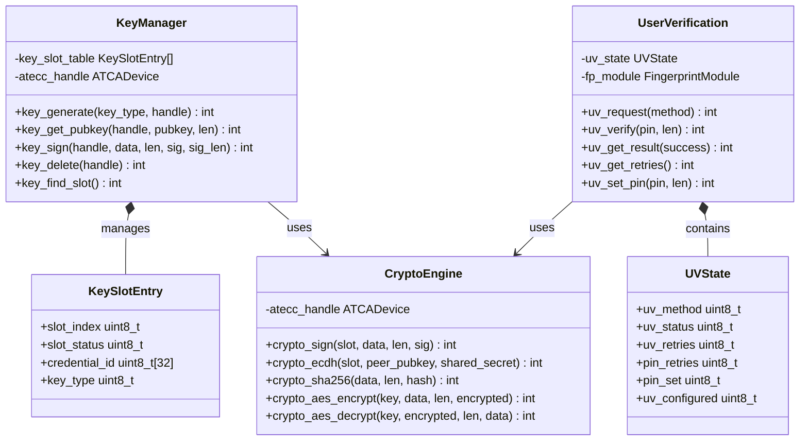

### 3.3 指纹模块类图

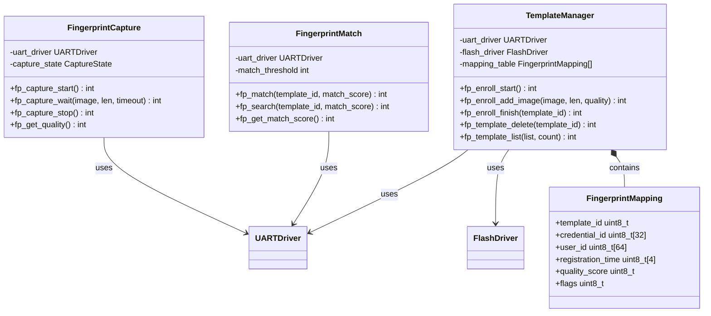

### 3.4 CTAP 协议栈类图

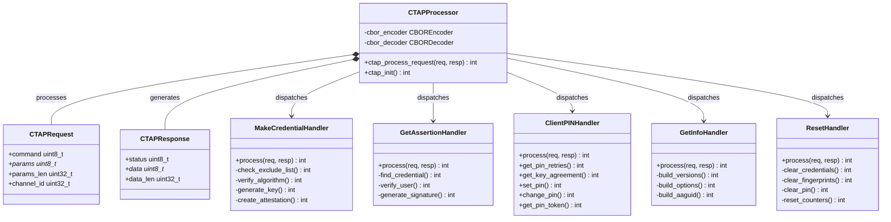

### 3.5 通信模块类图

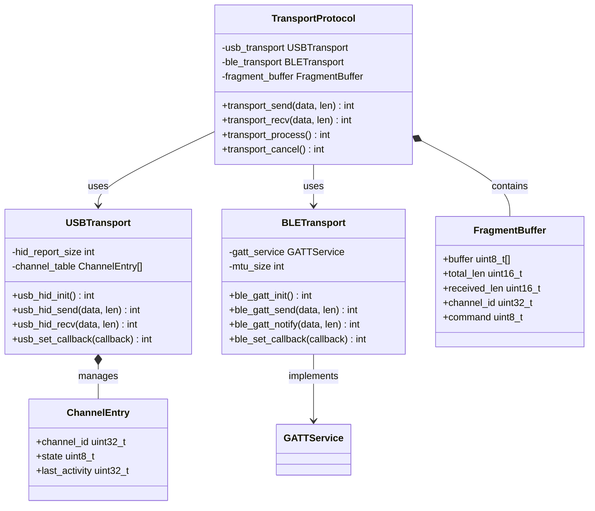

### 3.6 存储模块类图

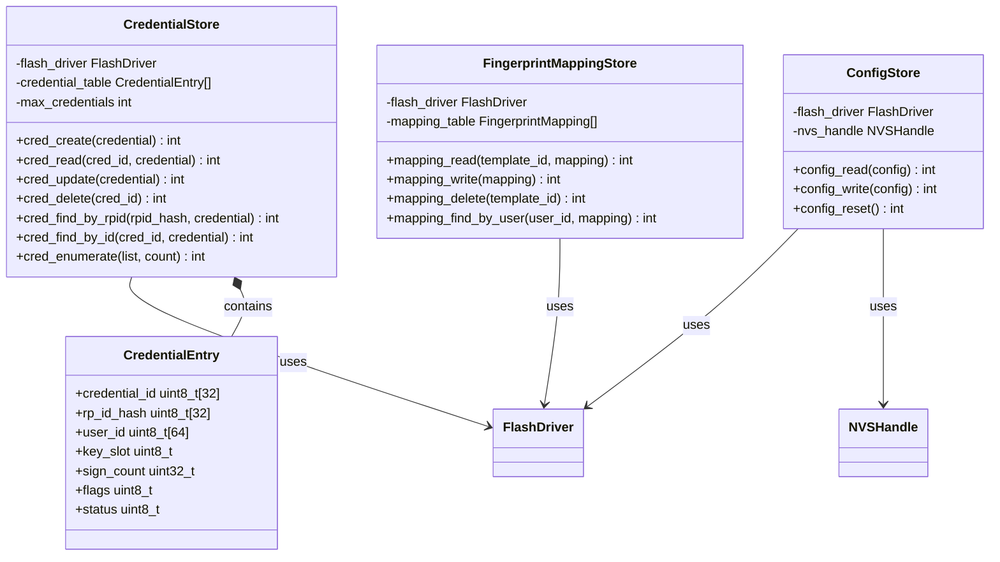

### 3.7 整体系统类图

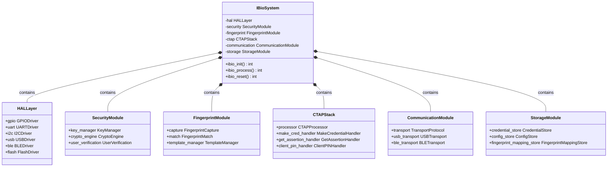

---

## 四、Flash 分区设计

### 4.1 分区表定义

| 分区名称 | 偏移地址 | 大小 | 类型 | 用途 |
|----------|----------|------|------|------|
| nvs | 0x9000 | 24 KB | data | NVS 配置存储 |
| otadata | 0x8000 | 8 KB | data | OTA 状态 |
| factory | 0x10000 | 1.5 MB | app | 固件主分区 |
| ota_0 | 0x190000 | 1.5 MB | app | OTA 分区 0 |
| ota_1 | 0x2E0000 | 1.5 MB | app | OTA 分区 1 |
| credential | 0x430000 | 128 KB | data | 凭证存储 |
| fingerprint | 0x450000 | 64 KB | data | 指纹模板映射 |
| config | 0x460000 | 32 KB | data | 配置存储 |

总容量：8 MB，已分配约 4.75 MB

### 4.2 分区详细说明

| 分区名称 | 详细用途 |
|----------|----------|
| **nvs** | 存储 Wi-Fi 配置、设备状态、运行参数 |
| **otadata** | OTA 升级状态标记，决定启动分区 |
| **factory** | 出厂固件，首次烧录位置 |
| **ota_0** | OTA 升级分区 A |
| **ota_1** | OTA 升级分区 B，支持 A/B 交换升级 |
| **credential** | 存储 FIDO2 resident credential 数据 |
| **fingerprint** | 存储指纹模板 ID 与用户映射关系 |
| **config** | 存储设备配置、PIN 设置、安全参数 |

### 4.3 分区 CSV 文件（ESP-IDF 格式）

```csv
# Name,   Type, SubType, Offset,   Size, Flags
nvs,      data, nvs,     0x9000,   24K
otadata,  data, ota,     0x8000,   8K
factory,  app,  factory, 0x10000,  1536K
ota_0,    app,  ota_0,   0x190000, 1536K
ota_1,    app,  ota_1,   0x2E0000, 1536K
credential,data, custom,  0x430000, 128K
fingerprint,data, custom, 0x450000, 64K
config,   data, custom,  0x460000, 32K
```

---

## 五、数据结构定义

### 5.1 凭证数据结构

```c
/**
 * FIDO2 Resident Credential 结构
 * 存储在 Flash credential 分区
 */
typedef struct {
    uint8_t credential_id[32];     /**< 凭证 ID（随机生成） */
    uint8_t rp_id_hash[32];        /**< RP ID SHA-256 哈希 */
    uint8_t user_id[64];           /**< 用户 ID（来自 MakeCredential） */
    uint8_t user_name[64];         /**< 用户名称（可选） */
    uint8_t user_display_name[64]; /**< 用户显示名称（可选） */
    uint8_t key_slot;              /**< ATECC608A 密钥槽位索引 (0-9) */
    uint8_t key_type;              /**< 密钥类型：ES256 (-7) */
    uint32_t sign_count;           /**< 签名计数器（防重放） */
    uint8_t creation_time[4];      /**< 创建时间戳 */
    uint8_t flags;                 /**< 凭证标志位 */
    uint8_t reserved[32];          /**< 保留字段 */
} ibio_credential_t;

// 凭证标志位定义
#define CRED_FLAG_RK           0x01  /**< Resident credential */
#define CRED_FLAG_UV_REQUIRED  0x02  /**< 需要用户验证 */
#define CRED_FLAG_ACTIVE       0x04  /**< 凭证激活状态 */

// 凭证大小计算
#define IBIO_CREDENTIAL_SIZE   sizeof(ibio_credential_t)  // 约 208 bytes
#define IBIO_MAX_CREDENTIALS   64  // 最大凭证数量
```

### 5.2 指纹模板映射结构

```c
/**
 * 指纹模板与用户映射结构
 * 存储在 Flash fingerprint 分区
 */
typedef struct {
    uint8_t template_id;           /**< FPM383C 模板 ID (0-199) */
    uint8_t credential_id[32];     /**< 对应的凭证 ID */
    uint8_t user_id[64];           /**< 用户 ID */
    uint8_t registration_time[4];  /**< 注册时间戳 */
    uint8_t quality_score;         /**< 模板质量分数 */
    uint8_t flags;                 /**< 模板标志位 */
    uint8_t reserved[16];          /**< 保留字段 */
} ibio_fingerprint_mapping_t;

// 指纹模板标志位定义
#define FP_FLAG_ACTIVE      0x01  /**< 模板激活 */
#define FP_FLAG_PRIMARY     0x02  /**< 主要指纹 */
#define FP_FLAG_VERIFIED    0x04  /**< 已验证可用 */

// 指纹映射大小计算
#define IBIO_FP_MAPPING_SIZE    sizeof(ibio_fingerprint_mapping_t)  // 约 118 bytes
#define IBIO_MAX_FP_TEMPLATES   10  // 最大指纹模板数量（用户）
```

### 5.3 设备配置结构

```c
/**
 * 设备配置结构
 * 存储在 Flash config 分区
 */
typedef struct {
    uint8_t aaguid[16];            /**< 认证器 AAGUID */
    uint8_t pin_hash[16];          /**< PIN 哈希（SHA-256 前 16 字节） */
    uint8_t pin_salt[16];          /**< PIN 盐值 */
    uint8_t pin_retries;           /**< PIN 重试剩余次数 */
    uint8_t uv_retries;            /**< UV（指纹）重试剩余次数 */
    uint8_t pin_set;               /**< PIN 是否设置标志 */
    uint8_t uv_configured;         /**< UV 是否配置标志 */
    uint32_t total_sign_count;     /**< 总签名计数 */
    uint8_t attestation_key_slot;  /**< Attestation 密钥槽位 (14) */
    uint8_t device_state;          /**< 设备状态 */
    uint8_t config_version;        /**< 配置版本号 */
    uint8_t reserved[224];         /**< 保留字段 */
} ibio_config_t;

// 设备状态定义
#define DEVICE_STATE_NORMAL     0x00  /**< 正常状态 */
#define DEVICE_STATE_SETUP      0x01  /**< 设置状态 */
#define DEVICE_STATE_LOCKED     0x02  /**< PIN/UV 锁定 */
#define DEVICE_STATE_RESET      0x03  /**< 待重置 */

// 配置大小
#define IBIO_CONFIG_SIZE        sizeof(ibio_config_t)  // 约 288 bytes
```

### 5.4 CTAP 请求/响应结构

```c
/**
 * CTAP 请求结构
 */
typedef struct {
    uint8_t command;               /**< CTAP 命令字节 */
    uint8_t *params;               /**< CBOR 编码参数 */
    uint32_t params_len;           /**< 参数长度 */
    uint32_t channel_id;           /**< HID 通道 ID */
} ctap_request_t;

/**
 * CTAP 响应结构
 */
typedef struct {
    uint8_t status;                /**< CTAP 状态码 */
    uint8_t *data;                 /**< CBOR 编码响应数据 */
    uint32_t data_len;             /**< 数据长度 */
} ctap_response_t;

// CTAP 命令定义
#define CTAP_CMD_MAKE_CREDENTIAL     0x01
#define CTAP_CMD_GET_ASSERTION       0x02
#define CTAP_CMD_GET_INFO            0x04
#define CTAP_CMD_CLIENT_PIN          0x06
#define CTAP_CMD_RESET               0x07
#define CTAP_CMD_GET_NEXT_ASSERTION  0x08
#define CTAP_CMD_CREDENTIAL_MGMT     0x0A
#define CTAP_CMD_SELECTION           0x0B

// CTAP 状态码定义
#define CTAP_STATUS_OK               0x00
#define CTAP_STATUS_ERR_INVALID_CMD  0x01
#define CTAP_STATUS_ERR_INVALID_PARAM 0x02
#define CTAP_STATUS_ERR_INVALID_LEN  0x03
#define CTAP_STATUS_ERR_PIN_INVALID  0x04
#define CTAP_STATUS_ERR_PIN_BLOCKED  0x05
#define CTAP_STATUS_ERR_UV_BLOCKED   0x06
#define CTAP_STATUS_ERR_NO_CREDENTIALS 0x07
#define CTAP_STATUS_ERR_CREDENTIAL_EXCLUDED 0x08
```

### 5.5 认证器数据结构

```c
/**
 * WebAuthn 认证器数据结构
 * 用于 MakeCredential 和 GetAssertion 响应
 */
typedef struct {
    uint8_t rp_id_hash[32];        /**< RP ID SHA-256 哈希 */
    uint8_t flags;                 /**< 认证器标志位 */
    uint32_t sign_count;           /**< 签名计数器（BE） */
    uint8_t attested_cred_data[];  /**< Attested credential data（可选） */
    uint8_t extensions[];          /**< 扩展数据（可选） */
} auth_data_t;

// 认证器标志位定义
#define AUTH_FLAG_UP         0x01  /**< User Present */
#define AUTH_FLAG_UV         0x04  /**< User Verified */
#define AUTH_FLAG_AT         0x40  /**< Attested credential data included */
#define AUTH_FLAG_ED         0x80  /**< Extension data included */

/**
 * Attested Credential Data 结构
 */
typedef struct {
    uint8_t aaguid[16];            /**< 认证器 AAGUID */
    uint16_t cred_id_len;          /**< Credential ID 长度（BE） */
    uint8_t cred_id[];             /**< Credential ID */
    uint8_t cose_pubkey[];         /**< COSE 编码公钥 */
} attested_cred_data_t;
```

### 5.6 密钥管理结构

```c
/**
 * 密钥槽位映射结构
 * 管理 ATECC608A 密钥槽位与凭证的关系
 */
typedef struct {
    uint8_t slot_index;            /**< ATECC608A 槽位索引 (0-15) */
    uint8_t slot_type;             /**< 槽位类型 */
    uint8_t credential_id[32];     /**< 关联的凭证 ID */
    uint8_t key_status;            /**< 密钥状态 */
    uint8_t reserved[8];           /**< 保留字段 */
} ibio_key_slot_t;

// 槽位类型定义
#define SLOT_TYPE_CREDENTIAL   0x01  /**< 凭证密钥槽位 */
#define SLOT_TYPE_ATTESTATION  0x02  /**< Attestation 密钥槽位 */
#define SLOT_TYPE_PIN          0x03  /**< PIN/ECDH 密钥槽位 */
#define SLOT_TYPE_TEMP         0x04  /**< 临时槽位 */

// 密钥状态定义
#define KEY_STATUS_EMPTY       0x00  /**< 空槽位 */
#define KEY_STATUS_ACTIVE      0x01  /**< 活跃密钥 */
#define KEY_STATUS_LOCKED      0x02  /**< 锁定状态 */
```

---

## 六、API 详细定义

### 6.1 HAL 层 API

#### 6.1.1 GPIO 驱动 API

```c
/**
 * @file gpio_driver.h
 * @brief GPIO 驱动接口定义
 */

#ifndef GPIO_DRIVER_H
#define GPIO_DRIVER_H

#include <stdint.h>

/** GPIO 模式定义 */
typedef enum {
    GPIO_MODE_INPUT,        /**< 输入模式 */
    GPIO_MODE_OUTPUT,       /**< 输出模式 */
    GPIO_MODE_INTERRUPT     /**< 中断模式 */
} gpio_mode_t;

/** GPIO 中断类型定义 */
typedef enum {
    GPIO_INTR_DISABLE,      /**< 禁用中断 */
    GPIO_INTR_POSEDGE,      /**< 上升沿触发 */
    GPIO_INTR_NEGEDGE,      /**< 下降沿触发 */
    GPIO_INTR_ANYEDGE,      /**< 双边沿触发 */
    GPIO_INTR_LOW_LEVEL,    /**< 低电平触发 */
    GPIO_INTR_HIGH_LEVEL    /**< 高电平触发 */
} gpio_intr_type_t;

/** GPIO 中断回调函数类型 */
typedef void (*gpio_callback_t)(uint8_t pin);

/**
 * @brief 初始化 GPIO 引脚
 * @param pin GPIO 引脚编号
 * @param mode GPIO 模式
 * @return 0 成功，负值失败
 */
int gpio_init(uint8_t pin, gpio_mode_t mode);

/**
 * @brief 读取 GPIO 引脚状态
 * @param pin GPIO 引脚编号
 * @return 0 低电平，1 高电平，负值失败
 */
int gpio_read(uint8_t pin);

/**
 * @brief 写入 GPIO 引脚状态
 * @param pin GPIO 引脚编号
 * @param value 写入值（0 或 1）
 * @return 0 成功，负值失败
 */
int gpio_write(uint8_t pin, uint8_t value);

/**
 * @brief 设置 GPIO 中断
 * @param pin GPIO 引脚编号
 * @param intr_type 中断类型
 * @param callback 中断回调函数
 * @return 0 成功，负值失败
 */
int gpio_set_interrupt(uint8_t pin, gpio_intr_type_t intr_type, gpio_callback_t callback);

/**
 * @brief 批量初始化 GPIO 引脚
 * @return 0 成功，负值失败
 */
int gpio_init_all(void);

#endif /* GPIO_DRIVER_H */
```

#### 6.1.2 UART 驱动 API

```c
/**
 * @file uart_driver.h
 * @brief UART 驱动接口定义
 */

#ifndef UART_DRIVER_H
#define UART_DRIVER_H

#include <stdint.h>

/** UART 端口定义 */
#define UART_PORT_0     0
#define UART_PORT_1     1

/** UART 配置结构 */
typedef struct {
    uint32_t baudrate;      /**< 波特率 */
    uint8_t data_bits;      /**< 数据位（5-8） */
    uint8_t parity;         /**< 校验位（0=无, 1=奇, 2=偶） */
    uint8_t stop_bits;      /**< 停止位（1-2） */
    uint32_t rx_buffer_size; /**< 接收缓冲区大小 */
    uint32_t tx_buffer_size; /**< 发送缓冲区大小 */
} uart_config_t;

/** 默认 UART 配置（用于 FPM383C） */
#define UART_CONFIG_DEFAULT { \
    .baudrate = 57600, \
    .data_bits = 8, \
    .parity = 0, \
    .stop_bits = 1, \
    .rx_buffer_size = 2048, \
    .tx_buffer_size = 1024 \
}

/**
 * @brief 初始化 UART 端口
 * @param port UART 端口编号
 * @param config UART 配置参数
 * @return 0 成功，负值失败
 */
int uart_init(uint8_t port, uart_config_t *config);

/**
 * @brief 从 UART 端口读取数据
 * @param port UART 端口编号
 * @param data 数据缓冲区
 * @param len 期望读取长度
 * @param timeout 超时时间（毫秒）
 * @return 实际读取长度，负值失败
 */
int uart_read(uint8_t port, uint8_t *data, uint32_t len, uint32_t timeout);

/**
 * @brief 向 UART 端口写入数据
 * @param port UART 端口编号
 * @param data 数据缓冲区
 * @param len 写入长度
 * @return 实际写入长度，负值失败
 */
int uart_write(uint8_t port, uint8_t *data, uint32_t len);

/**
 * @brief 清空 UART 端口缓冲区
 * @param port UART 端口编号
 * @return 0 成功，负值失败
 */
int uart_flush(uint8_t port);

/**
 * @brief 获取 UART 端口可用数据长度
 * @param port UART 端口编号
 * @return 可用数据长度，负值失败
 */
int uart_available(uint8_t port);

#endif /* UART_DRIVER_H */
```

#### 6.1.3 I2C 驱动 API

```c
/**
 * @file i2c_driver.h
 * @brief I2C 驱动接口定义
 */

#ifndef I2C_DRIVER_H
#define I2C_DRIVER_H

#include <stdint.h>

/** I2C 总线定义 */
#define I2C_BUS_0       0
#define I2C_BUS_1       1

/** ATECC608A I2C 地址 */
#define ATECC608A_ADDR  0x60    /**< 7-bit 地址 */
#define ATECC608A_ADDR_8BIT 0xC0 /**< 8-bit 地址 */

/** I2C 配置结构 */
typedef struct {
    uint8_t bus;            /**< I2C 总线编号 */
    uint32_t frequency;     /**< 时钟频率（Hz） */
    uint8_t sda_pin;        /**< SDA 引脚 */
    uint8_t scl_pin;        /**< SCL 引脚 */
} i2c_config_t;

/** 默认 I2C 配置（用于 ATECC608A） */
#define I2C_CONFIG_DEFAULT { \
    .bus = I2C_BUS_0, \
    .frequency = 400000, \
    .sda_pin = 21, \
    .scl_pin = 22 \
}

/**
 * @brief 初始化 I2C 总线
 * @param config I2C 配置参数
 * @return 0 成功，负值失败
 */
int i2c_init(i2c_config_t *config);

/**
 * @brief 从 I2C 设备读取数据
 * @param bus I2C 总线编号
 * @param addr 设备地址（7-bit）
 * @param data 数据缓冲区
 * @param len 读取长度
 * @return 0 成功，负值失败
 */
int i2c_read(uint8_t bus, uint8_t addr, uint8_t *data, uint32_t len);

/**
 * @brief 向 I2C 设备写入数据
 * @param bus I2C 总线编号
 * @param addr 设备地址（7-bit）
 * @param data 数据缓冲区
 * @param len 写入长度
 * @return 0 成功，负值失败
 */
int i2c_write(uint8_t bus, uint8_t addr, uint8_t *data, uint32_t len);

/**
 * @brief 探测 I2C 设备是否存在
 * @param bus I2C 总线编号
 * @param addr 设备地址（7-bit）
 * @return 0 存在，负值不存在或失败
 */
int i2c_probe(uint8_t bus, uint8_t addr);

/**
 * @brief I2C 写入后读取（组合操作）
 * @param bus I2C 总线编号
 * @param addr 设备地址（7-bit）
 * @param write_data 写入数据
 * @param write_len 写入长度
 * @param read_data 读取数据缓冲区
 * @param read_len 读取长度
 * @return 0 成功，负值失败
 */
int i2c_write_read(uint8_t bus, uint8_t addr, 
                   uint8_t *write_data, uint32_t write_len,
                   uint8_t *read_data, uint32_t read_len);

#endif /* I2C_DRIVER_H */
```

#### 6.1.4 USB 驱动 API

```c
/**
 * @file usb_driver.h
 * @brief USB HID 驱动接口定义
 */

#ifndef USB_DRIVER_H
#define USB_DRIVER_H

#include <stdint.h>

/** HID 报告大小 */
#define HID_REPORT_SIZE     64

/** FIDO HID Usage Page */
#define FIDO_USAGE_PAGE     0xF1D0

/** FIDO HID Usage */
#define FIDO_USAGE          0x01

/** USB 接收回调函数类型 */
typedef void (*usb_recv_callback_t)(uint8_t *data, uint32_t len);

/**
 * @brief 初始化 USB HID 设备
 * @return 0 成功，负值失败
 */
int usb_init(void);

/**
 * @brief 发送 HID 报告
 * @param data 数据缓冲区
 * @param len 数据长度（最大 64 字节）
 * @return 0 成功，负值失败
 */
int usb_send(uint8_t *data, uint32_t len);

/**
 * @brief 接收 HID 报告
 * @param data 数据缓冲区
 * @param len 数据长度
 * @param timeout 超时时间（毫秒）
 * @return 实际接收长度，负值失败
 */
int usb_recv(uint8_t *data, uint32_t len, uint32_t timeout);

/**
 * @brief 设置接收回调函数
 * @param callback 接收回调函数
 * @return 0 成功，负值失败
 */
int usb_set_callback(usb_recv_callback_t callback);

/**
 * @brief 启动 USB 任务
 * @return 0 成功，负值失败
 */
int usb_start(void);

/**
 * @brief 停止 USB 任务
 * @return 0 成功，负值失败
 */
int usb_stop(void);

#endif /* USB_DRIVER_H */
```

#### 6.1.5 Flash 驱动 API

```c
/**
 * @file flash_driver.h
 * @brief Flash 驱动接口定义
 */

#ifndef FLASH_DRIVER_H
#define FLASH_DRIVER_H

#include <stdint.h>

/** 分区类型定义 */
typedef enum {
    FLASH_PARTITION_CREDENTIAL,     /**< 凭证分区 */
    FLASH_PARTITION_FINGERPRINT,    /**< 指纹映射分区 */
    FLASH_PARTITION_CONFIG,         /**< 配置分区 */
    FLASH_PARTITION_NVS             /**< NVS 分区 */
} flash_partition_type_t;

/**
 * @brief 从 Flash 分区读取数据
 * @param partition 分区类型
 * @param offset 偏移地址
 * @param data 数据缓冲区
 * @param len 读取长度
 * @return 0 成功，负值失败
 */
int flash_read(flash_partition_type_t partition, uint32_t offset, 
               uint8_t *data, uint32_t len);

/**
 * @brief 向 Flash 分区写入数据
 * @param partition 分区类型
 * @param offset 偏移地址
 * @param data 数据缓冲区
 * @param len 写入长度
 * @return 0 成功，负值失败
 */
int flash_write(flash_partition_type_t partition, uint32_t offset,
                uint8_t *data, uint32_t len);

/**
 * @brief 擦除 Flash 分区
 * @param partition 分区类型
 * @param offset 偏移地址
 * @param len 擦除长度
 * @return 0 成功，负值失败
 */
int flash_erase(flash_partition_type_t partition, uint32_t offset, uint32_t len);

/**
 * @brief 从 NVS 读取键值
 * @param key 键名
 * @param value 值缓冲区
 * @param len 值长度
 * @return 0 成功，负值失败
 */
int nvs_get(const char *key, void *value, uint32_t len);

/**
 * @brief 向 NVS 写入键值
 * @param key 键名
 * @param value 值缓冲区
 * @param len 值长度
 * @return 0 成功，负值失败
 */
int nvs_set(const char *key, void *value, uint32_t len);

/**
 * @brief 从 NVS 删除键值
 * @param key 键名
 * @return 0 成功，负值失败
 */
int nvs_delete(const char *key);

#endif /* FLASH_DRIVER_H */
```

---

### 6.2 安全模块 API

#### 6.2.1 密钥管理 API

```c
/**
 * @file key_manager.h
 * @brief 密钥管理接口定义
 */

#ifndef KEY_MANAGER_H
#define KEY_MANAGER_H

#include <stdint.h>

/** 密钥类型定义 */
typedef enum {
    KEY_TYPE_ES256 = 0x01,      /**< ES256 (ECDSA P-256 + SHA-256) */
    KEY_TYPE_ECDH = 0x02,       /**< ECDH P-256 */
} key_type_t;

/** 密钥槽位状态定义 */
typedef enum {
    SLOT_STATUS_EMPTY = 0x00,   /**< 空槽位 */
    SLOT_STATUS_ACTIVE = 0x01,  /**< 活跃密钥 */
    SLOT_STATUS_LOCKED = 0x02,  /**< 锁定状态 */
} slot_status_t;

/** 密钥句柄结构 */
typedef struct {
    uint8_t slot_index;         /**< ATECC608A 槽位索引 */
    uint8_t key_type;           /**< 密钥类型 */
    uint8_t credential_id[32];  /**< 关联的凭证 ID */
} key_handle_t;

/** ATECC608A 槽位分配 */
#define ATECC_SLOT_CREDENTIAL_START   0    /**< 凭证密钥起始槽位 */
#define ATECC_SLOT_CREDENTIAL_END     9    /**< 凭证密钥结束槽位 */
#define ATECC_SLOT_ATTESTATION        14   /**< Attestation 密钥槽位 */
#define ATECC_SLOT_PIN                15   /**< PIN 密钥槽位 */

/**
 * @brief 初始化密钥管理模块
 * @return 0 成功，负值失败
 */
int key_manager_init(void);

/**
 * @brief 生成新的密钥对
 * @param key_type 密钥类型
 * @param handle 密钥句柄（输出）
 * @return 0 成功，负值失败
 */
int key_generate(key_type_t key_type, key_handle_t *handle);

/**
 * @brief 获取公钥
 * @param handle 密钥句柄
 * @param pubkey 公钥缓冲区（输出，65 字节）
 * @param len 公钥长度（输出）
 * @return 0 成功，负值失败
 */
int key_get_pubkey(key_handle_t *handle, uint8_t *pubkey, uint32_t *len);

/**
 * @brief 使用密钥签名
 * @param handle 密钥句柄
 * @param data 待签名数据（32 字节哈希）
 * @param data_len 数据长度
 * @param sig 签名缓冲区（输出，64 字节）
 * @param sig_len 签名长度（输出）
 * @return 0 成功，负值失败
 */
int key_sign(key_handle_t *handle, uint8_t *data, uint32_t data_len,
             uint8_t *sig, uint32_t *sig_len);

/**
 * @brief 删除密钥
 * @param handle 密钥句柄
 * @return 0 成功，负值失败
 */
int key_delete(key_handle_t *handle);

/**
 * @brief 查找空闲槽位
 * @param slot_index 空闲槽位索引（输出）
 * @return 0 成功，负值无空闲槽位
 */
int key_find_free_slot(uint8_t *slot_index);

/**
 * @brief 根据凭证 ID 查找密钥句柄
 * @param credential_id 凭证 ID
 * @param handle 密钥句柄（输出）
 * @return 0 成功，负值未找到
 */
int key_find_by_credential(uint8_t *credential_id, key_handle_t *handle);

#endif /* KEY_MANAGER_H */
```

#### 6.2.2 加密引擎 API

```c
/**
 * @file crypto_engine.h
 * @brief 加密引擎接口定义
 */

#ifndef CRYPTO_ENGINE_H
#define CRYPTO_ENGINE_H

#include <stdint.h>

/** SHA-256 哈希长度 */
#define SHA256_HASH_LEN    32

/** ES256 签名长度 */
#define ES256_SIG_LEN      64

/** ECDH 共享密钥长度 */
#define ECDH_SHARED_SECRET_LEN  32

/** 公钥长度（ uncompressed） */
#define ECC_PUBKEY_LEN     65

/**
 * @brief 初始化加密引擎模块
 * @return 0 成功，负值失败
 */
int crypto_engine_init(void);

/**
 * @brief ES256 签名
 * @param slot_index ATECC608A 槽位索引
 * @param message 待签名消息（32 字节）
 * @param signature 签名输出（64 字节）
 * @return 0 成功，负值失败
 */
int crypto_sign(uint8_t slot_index, uint8_t *message, uint8_t *signature);

/**
 * @brief ECDH 密钥协商
 * @param slot_index ATECC608A 槽位索引
 * @param peer_pubkey 对方公钥（65 字节）
 * @param shared_secret 共享密钥输出（32 字节）
 * @return 0 成功，负值失败
 */
int crypto_ecdh(uint8_t slot_index, uint8_t *peer_pubkey, uint8_t *shared_secret);

/**
 * @brief SHA-256 哈希计算
 * @param data 输入数据
 * @param data_len 数据长度
 * @param hash 哈希输出（32 字节）
 * @return 0 成功，负值失败
 */
int crypto_sha256(uint8_t *data, uint32_t data_len, uint8_t *hash);

/**
 * @brief AES-128 加密
 * @param key AES 密钥（16 字节）
 * @param data 输入数据
 * @param data_len 数据长度
 * @param encrypted 加密输出
 * @return 0 成功，负值失败
 */
int crypto_aes_encrypt(uint8_t *key, uint8_t *data, uint32_t data_len, 
                       uint8_t *encrypted);

/**
 * @brief AES-128 解密
 * @param key AES 密钥（16 字节）
 * @param encrypted 加密数据
 * @param encrypted_len 加密数据长度
 * @param data 解密输出
 * @return 0 成功，负值失败
 */
int crypto_aes_decrypt(uint8_t *key, uint8_t *encrypted, uint32_t encrypted_len,
                       uint8_t *data);

/**
 * @brief 生成随机数
 * @param random 随机数输出
 * @param len 随机数长度
 * @return 0 成功，负值失败
 */
int crypto_random(uint8_t *random, uint32_t len);

/**
 * @brief 获取 ATECC608A 设备信息
 * @param serial_num 序列号输出（9 字节）
 * @return 0 成功，负值失败
 */
int crypto_get_device_info(uint8_t *serial_num);

#endif /* CRYPTO_ENGINE_H */
```

#### 6.2.3 用户验证 API

```c
/**
 * @file user_verification.h
 * @brief 用户验证接口定义
 */

#ifndef USER_VERIFICATION_H
#define USER_VERIFICATION_H

#include <stdint.h>

/** UV 方式定义 */
typedef enum {
    UV_METHOD_NONE = 0x00,          /**< 无验证 */
    UV_METHOD_FINGERPRINT = 0x01,   /**< 指纹验证 */
    UV_METHOD_PIN = 0x02,           /**< PIN 验证 */
} uv_method_t;

/** UV 状态定义 */
typedef enum {
    UV_STATUS_NONE = 0x00,          /**< 未验证 */
    UV_STATUS_PROCESSING = 0x01,    /**< 正在验证 */
    UV_STATUS_SUCCESS = 0x02,       /**< 验证成功 */
    UV_STATUS_FAILED = 0x03,        /**< 验证失败 */
    UV_STATUS_BLOCKED = 0x04,       /**< 验证锁定 */
} uv_status_t;

/** 默认重试次数 */
#define UV_DEFAULT_RETRIES      8
#define PIN_DEFAULT_RETRIES     8

/** PIN 最小/最大长度 */
#define PIN_MIN_LENGTH          4
#define PIN_MAX_LENGTH          8

/**
 * @brief 初始化用户验证模块
 * @return 0 成功，负值失败
 */
int uv_init(void);

/**
 * @brief 请求用户验证
 * @param method 验证方式
 * @return 0 成功开始验证，负值失败
 */
int uv_request(uv_method_t method);

/**
 * @brief 获取验证结果
 * @param success 验证成功标志（输出）
 * @return 0 成功，负值验证未完成
 */
int uv_get_result(uint8_t *success);

/**
 * @brief 获取 UV 重试次数
 * @return UV 重试剩余次数
 */
uint8_t uv_get_uv_retries(void);

/**
 * @brief 获取 PIN 重试次数
 * @return PIN 重试剩余次数
 */
uint8_t uv_get_pin_retries(void);

/**
 * @brief 设置 PIN
 * @param pin PIN 值
 * @param pin_len PIN 长度
 * @return 0 成功，负值失败
 */
int uv_set_pin(uint8_t *pin, uint32_t pin_len);

/**
 * @brief 验证 PIN
 * @param pin PIN 值
 * @param pin_len PIN 长度
 * @return 0 成功，负值失败
 */
int uv_verify_pin(uint8_t *pin, uint32_t pin_len);

/**
 * @brief 修改 PIN
 * @param old_pin 当前 PIN
 * @param old_len 当前 PIN 长度
 * @param new_pin 新 PIN
 * @param new_len 新 PIN 长度
 * @return 0 成功，负值失败
 */
int uv_change_pin(uint8_t *old_pin, uint32_t old_len,
                  uint8_t *new_pin, uint32_t new_len);

/**
 * @brief 检查 PIN 是否已设置
 * @return 1 已设置，0 未设置
 */
uint8_t uv_pin_is_set(void);

/**
 * @brief 检查 UV 是否已配置（指纹）
 * @return 1 已配置，0 未配置
 */
uint8_t uv_is_configured(void);

/**
 * @brief 重置 UV 状态（清除锁定）
 * @return 0 成功，负值失败
 */
int uv_reset(void);

#endif /* USER_VERIFICATION_H */
```

---

### 6.3 指纹模块 API

```c
/**
 * @file fingerprint_module.h
 * @brief 指纹模块接口定义
 */

#ifndef FINGERPRINT_MODULE_H
#define FINGERPRINT_MODULE_H

#include <stdint.h>

/** 指纹采集状态 */
typedef enum {
    FP_CAPTURE_IDLE = 0x00,     /**< 空闲 */
    FP_CAPTURE_WAITING = 0x01,  /**< 等待手指 */
    FP_CAPTURE_PROCESSING = 0x02, /**< 正在采集 */
    FP_CAPTURE_COMPLETE = 0x03, /**< 采集完成 */
    FP_CAPTURE_FAILED = 0x04,   /**< 采集失败 */
} fp_capture_state_t;

/** 指纹比对结果 */
typedef enum {
    FP_MATCH_SUCCESS = 0x00,    /**< 比对成功 */
    FP_MATCH_FAILED = 0x01,     /**< 比对失败 */
    FP_MATCH_NO_TEMPLATE = 0x02, /**< 无模板 */
} fp_match_result_t;

/** 指纹模板质量阈值 */
#define FP_QUALITY_THRESHOLD   50

/** 最大指纹模板数量 */
#define FP_MAX_TEMPLATES       10

/** 指纹比对结果结构 */
typedef struct {
    uint8_t result;             /**< 比对结果 */
    uint8_t template_id;        /**< 匹配的模板 ID */
    uint16_t match_score;       /**< 匹配分数 */
} fp_match_info_t;

/**
 * @brief 初始化指纹模块
 * @return 0 成功，负值失败
 */
int fp_init(void);

/**
 * @brief 开始指纹采集
 * @return 0 成功，负值失败
 */
int fp_capture_start(void);

/**
 * @brief 等待指纹采集完成
 * @param quality 采集质量（输出）
 * @param timeout 超时时间（毫秒）
 * @return 0 成功，负值失败或超时
 */
int fp_capture_wait(uint8_t *quality, uint32_t timeout);

/**
 * @brief 停止指纹采集
 * @return 0 成功，负值失败
 */
int fp_capture_stop(void);

/**
 * @brief 指纹 1:1 比对
 * @param template_id 模板 ID
 * @param match_info 比对结果（输出）
 * @return 0 成功，负值失败
 */
int fp_match(uint8_t template_id, fp_match_info_t *match_info);

/**
 * @brief 指纹 1:N 搜索
 * @param match_info 比对结果（输出）
 * @return 0 成功，负值失败或未找到
 */
int fp_search(fp_match_info_t *match_info);

/**
 * @brief 开始指纹注册
 * @return 0 成功，负值失败
 */
int fp_enroll_start(void);

/**
 * @brief 添加注册图像
 * @param quality 图像质量（输出）
 * @return 0 成功，负值失败
 */
int fp_enroll_add_image(uint8_t *quality);

/**
 * @brief 完成指纹注册
 * @param template_id 生成的模板 ID（输出）
 * @return 0 成功，负值失败
 */
int fp_enroll_finish(uint8_t *template_id);

/**
 * @brief 取消指纹注册
 * @return 0 成功，负值失败
 */
int fp_enroll_cancel(void);

/**
 * @brief 删除指纹模板
 * @param template_id 模板 ID
 * @return 0 成功，负值失败
 */
int fp_template_delete(uint8_t template_id);

/**
 * @brief 删除所有指纹模板
 * @return 0 成功，负值失败
 */
int fp_template_delete_all(void);

/**
 * @brief 获取指纹模板数量
 * @return 模板数量
 */
uint8_t fp_template_count(void);

/**
 * @brief 获取指纹模板列表
 * @param template_ids 模板 ID 列表（输出）
 * @param count 模板数量（输出）
 * @return 0 成功，负值失败
 */
int fp_template_list(uint8_t *template_ids, uint8_t *count);

/**
 * @brief 检查指纹模块状态
 * @return 0 正常，负值异常
 */
int fp_check_status(void);

#endif /* FINGERPRINT_MODULE_H */
```

---

### 6.4 CTAP 协议栈 API

```c
/**
 * @file ctap_protocol.h
 * @brief CTAP 协议栈接口定义
 */

#ifndef CTAP_PROTOCOL_H
#define CTAP_PROTOCOL_H

#include <stdint.h>

/** CTAP 命令定义 */
#define CTAP_CMD_MAKE_CREDENTIAL       0x01
#define CTAP_CMD_GET_ASSERTION         0x02
#define CTAP_CMD_GET_INFO              0x04
#define CTAP_CMD_CLIENT_PIN            0x06
#define CTAP_CMD_RESET                 0x07
#define CTAP_CMD_GET_NEXT_ASSERTION    0x08
#define CTAP_CMD_CREDENTIAL_MANAGEMENT 0x0A
#define CTAP_CMD_SELECTION             0x0B

/** CTAP 状态码定义（详见第八章） */
#define CTAP_STATUS_OK                 0x00

/** CTAP 请求结构 */
typedef struct {
    uint8_t command;             /**< CTAP 命令字节 */
    uint8_t *params;             /**< CBOR 编码参数 */
    uint32_t params_len;         /**< 参数长度 */
    uint32_t channel_id;         /**< HID 通道 ID */
} ctap_request_t;

/** CTAP 响应结构 */
typedef struct {
    uint8_t status;              /**< CTAP 状态码 */
    uint8_t *data;               /**< CBOR 编码响应数据 */
    uint32_t data_len;           /**< 数据长度 */
} ctap_response_t;

/** CTAP 选项结构 */
typedef struct {
    uint8_t rk;                  /**< Resident credential */
    uint8_t uv;                  /**< User verification */
    uint8_t up;                  /**< User present */
} ctap_options_t;

/** MakeCredential 参数结构 */
typedef struct {
    uint8_t client_data_hash[32]; /**< 客户端数据哈希 */
    uint8_t *rp_id;              /**< RP ID */
    uint32_t rp_id_len;          /**< RP ID 长度 */
    uint8_t *rp_name;            /**< RP 名称 */
    uint8_t *user_id;            /**< 用户 ID */
    uint32_t user_id_len;        /**< 用户 ID 长度 */
    uint8_t *user_name;          /**< 用户名称 */
    int32_t algorithm;           /**< 算法（ES256: -7） */
    ctap_options_t options;      /**< 选项 */
    uint8_t *exclude_list;       /**< 排除列表 */
    uint32_t exclude_list_len;   /**< 排除列表长度 */
    uint8_t *pin_uv_auth_token;  /**< PIN/UV 认证令牌 */
    uint32_t pin_uv_auth_token_len; /**< 令牌长度 */
} ctap_make_credential_params_t;

/** GetAssertion 参数结构 */
typedef struct {
    uint8_t *rp_id;              /**< RP ID */
    uint32_t rp_id_len;          /**< RP ID 长度 */
    uint8_t client_data_hash[32]; /**< 客户端数据哈希 */
    uint8_t *allow_list;         /**< 允许列表 */
    uint32_t allow_list_len;     /**< 允许列表长度 */
    ctap_options_t options;      /**< 选项 */
    uint8_t *pin_uv_auth_token;  /**< PIN/UV 认证令牌 */
    uint32_t pin_uv_auth_token_len; /**< 令牌长度 */
} ctap_get_assertion_params_t;

/**
 * @brief 初始化 CTAP 协议栈
 * @return 0 成功，负值失败
 */
int ctap_init(void);

/**
 * @brief 处理 CTAP 请求
 * @param req CTAP 请求结构
 * @param resp CTAP 响应结构（输出）
 * @return 0 成功，负值失败
 */
int ctap_process_request(ctap_request_t *req, ctap_response_t *resp);

/**
 * @brief 处理 MakeCredential 命令
 * @param params 参数结构
 * @param resp 响应结构（输出）
 * @return CTAP 状态码
 */
uint8_t ctap_make_credential(ctap_make_credential_params_t *params, 
                             ctap_response_t *resp);

/**
 * @brief 处理 GetAssertion 命令
 * @param params 参数结构
 * @param resp 响应结构（输出）
 * @return CTAP 状态码
 */
uint8_t ctap_get_assertion(ctap_get_assertion_params_t *params,
                           ctap_response_t *resp);

/**
 * @brief 处理 GetInfo 命令
 * @param resp 响应结构（输出）
 * @return CTAP 状态码
 */
uint8_t ctap_get_info(ctap_response_t *resp);

/**
 * @brief 处理 ClientPIN 命令
 * @param params CBOR 编码参数
 * @param params_len 参数长度
 * @param resp 响应结构（输出）
 * @return CTAP 状态码
 */
uint8_t ctap_client_pin(uint8_t *params, uint32_t params_len,
                        ctap_response_t *resp);

/**
 * @brief 处理 Reset 命令
 * @param resp 响应结构（输出）
 * @return CTAP 状态码
 */
uint8_t ctap_reset(ctap_response_t *resp);

/**
 * @brief 处理 GetNextAssertion 命令
 * @param resp 响应结构（输出）
 * @return CTAP 状态码
 */
uint8_t ctap_get_next_assertion(ctap_response_t *resp);

/**
 * @brief 处理 CredentialManagement 命令
 * @param params CBOR 编码参数
 * @param params_len 参数长度
 * @param resp 响应结构（输出）
 * @return CTAP 状态码
 */
uint8_t ctap_credential_management(uint8_t *params, uint32_t params_len,
                                   ctap_response_t *resp);

/**
 * @brief 处理 Selection 命令
 * @param resp 响应结构（输出）
 * @return CTAP 状态码
 */
uint8_t ctap_selection(ctap_response_t *resp);

/**
 * @brief 取消当前操作
 * @return 0 成功，负值无操作
 */
int ctap_cancel(void);

/**
 * @brief 获取认证器 AAGUID
 * @param aaguid AAGUID 输出（16 字节）
 * @return 0 成功，负值失败
 */
int ctap_get_aaguid(uint8_t *aaguid);

#endif /* CTAP_PROTOCOL_H */
```

---

## 七、状态机设计

### 7.1 整体认证流程状态机

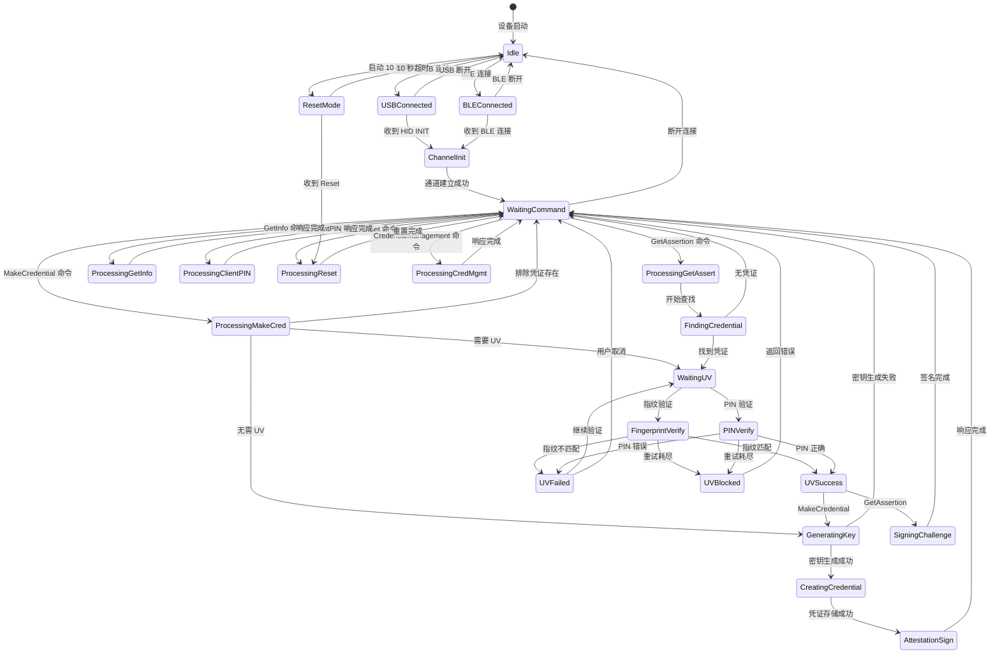

### 7.2 MakeCredential 详细状态机

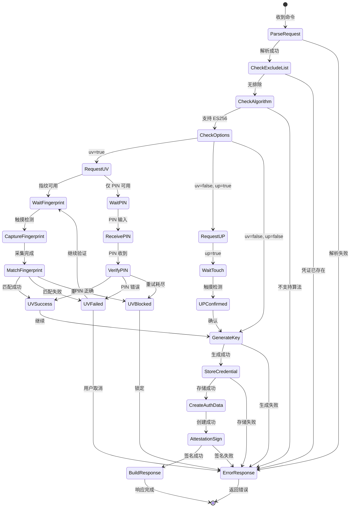

### 7.3 GetAssertion 详细状态机

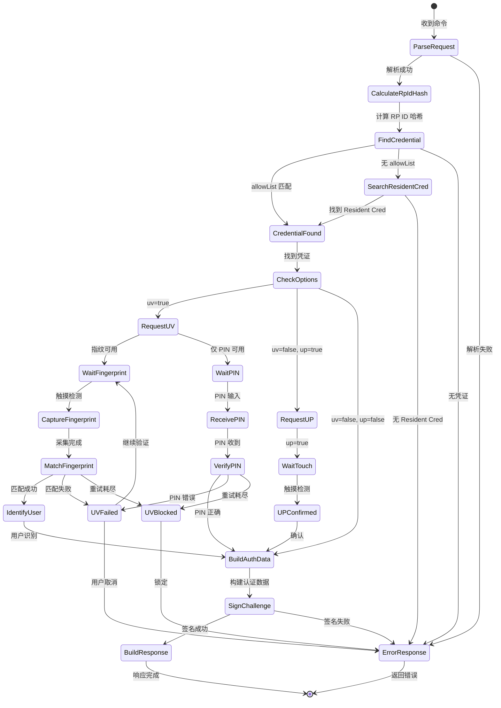

### 7.4 指纹验证状态机

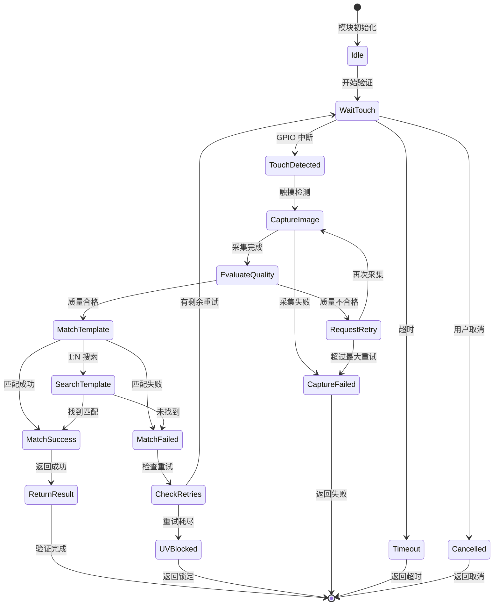

### 7.5 指纹注册状态机

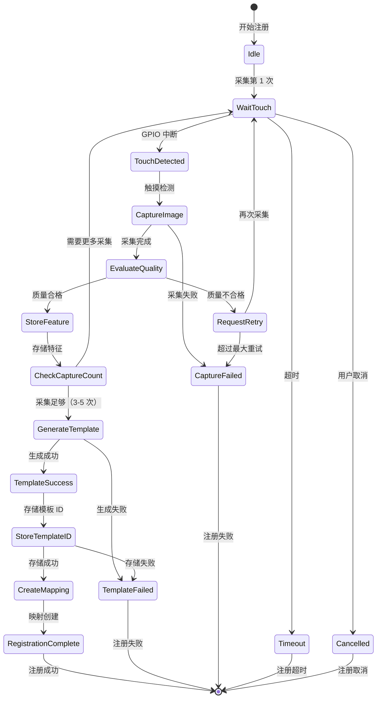

### 7.6 USB HID 通信状态机

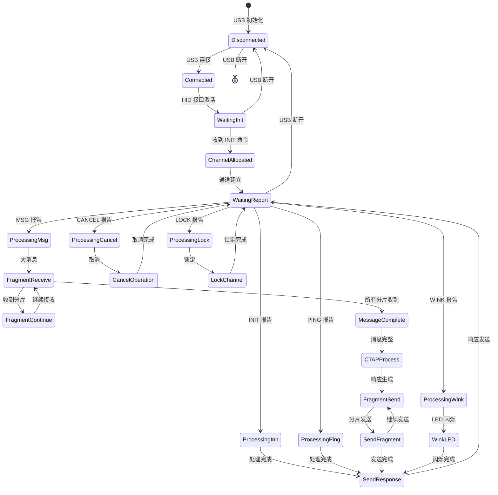

### 7.7 BLE GATT 通信状态机

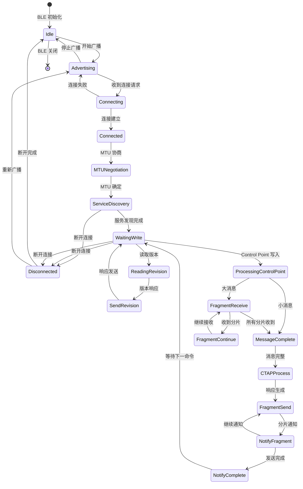

---

## 八、错误处理机制

### 8.1 CTAP 错误码表

**标准 CTAP 错误码（CTAP2 规范定义）**：

| 错误码 | 名称 | 描述 | 处理建议 |
|--------|------|------|----------|
| **0x00** | CTAP1_SUCCESS | 操作成功 | 正常响应 |
| **0x01** | CTAP2_ERR_INVALID_COMMAND | 无效命令 | 返回错误响应 |
| **0x02** | CTAP2_ERR_INVALID_PARAMETER | 无效参数 | 检查 CBOR 参数 |
| **0x03** | CTAP2_ERR_INVALID_LENGTH | 无效长度 | 检查数据长度 |
| **0x04** | CTAP2_ERR_INVALID_SEQ | 无效序列号 | HID 分片错误 |
| **0x05** | CTAP2_ERR_TIMEOUT | 操作超时 | 重新发起请求 |
| **0x06** | CTAP2_ERR_CHANNEL_BUSY | 通道忙 | 等待后重试 |
| **0x07** | CTAP2_ERR_LOCK_REQUIRED | 需要锁定 | 先执行 LOCK |
| **0x08** | CTAP2_ERR_INVALID_CHANNEL | 无效通道 | 重新 INIT |
| **0x09** | CTAP2_ERR_CBOR_UNEXPECTED_TYPE | CBOR 类型错误 | 检查 CBOR 格式 |
| **0x0A** | CTAP2_ERR_INVALID_CBOR | 无效 CBOR | 检查 CBOR 编码 |
| **0x0B** | CTAP2_ERR_MISSING_PARAMETER | 缺少参数 | 补充必需参数 |
| **0x0C** | CTAP2_ERR_LIMIT_EXCEEDED | 超出限制 | 减少请求量 |
| **0x0D** | CTAP2_ERR_UNSUPPORTED_EXTENSION | 不支持扩展 | 移除扩展参数 |
| **0x0E** | CTAP2_ERR_CREDENTIAL_EXCLUDED | 凭证已排除 | 使用其他凭证 |
| **0x0F** | CTAP2_ERR_PROCESSING | 正在处理 | 等待 KEEPALIVE |
| **0x10** | CTAP2_ERR_INVALID_CREDENTIAL | 无效凭证 | 检查凭证 ID |
| **0x11** | CTAP2_ERR_USER_ACTION_PENDING | 用户操作等待 | 等待用户操作 |
| **0x12** | CTAP2_ERR_OPERATION_PENDING | 操作等待 | 继续等待 |
| **0x13** | CTAP2_ERR_UNSUPPORTED_ALGORITHM | 不支持算法 | 使用 ES256 |
| **0x14** | CTAP2_ERR_UNSUPPORTED_OPTION | 不支持选项 | 检查 options |
| **0x15** | CTAP2_ERR_UNSUPPORTED_PIN_METHOD | 不支持 PIN 方法 | 检查 pinUvAuthProtocol |
| **0x16** | CTAP2_ERR_UV_BLOCKED | UV 锁定 | 等待解锁或重置 |
| **0x17** | CTAP2_ERR_PIN_BLOCKED | PIN 锁定 | 等待重置 |
| **0x18** | CTAP2_ERR_PIN_AUTH_BLOCKED | PIN 认证锁定 | 等待解锁 |
| **0x19** | CTAP2_ERR_UV_AUTH_BLOCKED | UV 认证锁定 | 等待解锁 |
| **0x1A** | CTAP2_ERR_NO_CREDENTIALS | 无凭证 | 注册新凭证 |
| **0x1B** | CTAP2_ERR_SPECIFICATION_MISMATCH | 规范不匹配 | 检查协议版本 |
| **0x1C** | CTAP2_ERR_PIN_NOT_SET | PIN 未设置 | 先设置 PIN |
| **0x1D** | CTAP2_ERR_UV_NOT_AVAILABLE | UV 不可用 | 检查指纹配置 |
| **0x1E** | CTAP2_ERR_UV_NOT_SET | UV 未配置 | 先配置指纹 |
| **0x1F** | CTAP2_ERR_UV_INVALID | UV 无效 | 重新验证 |
| **0x20** | CTAP2_ERR_UV_RETRY_LIMIT | UV 重试耗尽 | 等待解锁 |
| **0x21** | CTAP2_ERR_UV_RETRY_LIMIT_REACHED | UV 重试次数已达 | 等待解锁 |
| **0x22** | CTAP2_ERR_ACTION_TIMEOUT | 操作超时 | 重新操作 |
| **0x23** | CTAP2_ERR_UP_REQUIRED | 需要 UP | 用户确认 |
| **0x24** | CTAP2_ERR_UV_REQUIRED | 需要 UV | 用户验证 |
| **0x25** | CTAP2_ERR_UV_ACCURACY_LIMIT | UV 精度限制 | 重新注册指纹 |
| **0x26** | CTAP2_ERR_NO_UP | 无 UP | 用户在场确认 |
| **0x27** | CTAP2_ERR_NO_UV | 无 UV | 用户验证 |
| **0x28** | CTAP2_ERR_UV_ACCURACY_INSUFFICIENT | UV 精度不足 | 重新采集指纹 |
| **0x29** | CTAP2_ERR_PIN_AUTH_INVALID | PIN 认证无效 | 重新验证 PIN |
| **0x2A** | CTAP2_ERR_REQUEST_TOO_LARGE | 请求过大 | 减小请求大小 |
| **0x2B** | CTAP2_ERR_KEY_STORE_FULL | 密钥存储满 | 删除旧凭证 |
| **0x2C** | CTAP2_ERR_NOT_ALLOWED | 操作不允许 | 检查操作权限 |
| **0x2D** | CTAP2_ERR_USER_VERIFICATION_TIMEOUT | UV 超时 | 重新验证 |
| **0x2E** | CTAP2_ERR_USER_PRESENCE_TIMEOUT | UP 超时 | 重新确认 |
| **0x2F** | CTAP2_ERR_VENDOR_FIRST | 厂商自定义起始 | - |
| **0xFF** | CTAP2_ERR_VENDOR_LAST | 厂商自定义结束 | - |

**HID 错误码（FIDO HID 规范定义）**：

| 错误码 | 名称 | 描述 |
|--------|------|------|
| **0x01** | ERR_INVALID_CMD | 无效 HID 命令 |
| **0x02** | ERR_INVALID_PAR | 无效参数 |
| **0x03** | ERR_INVALID_LEN | 无效长度 |
| **0x04** | ERR_INVALID_SEQ | 无效序列号 |
| **0x05** | ERR_MSG_TIMEOUT | 消息超时 |
| **0x06** | ERR_CHANNEL_BUSY | 通道忙 |
| **0x07** | ERR_LOCK_REQUIRED | 需要锁定 |
| **0x08** | ERR_INVALID_CHANNEL | 无效通道 |
| **0x09** | ERR_OTHER | 其他错误 |

---

### 8.2 内部错误码

**IBio 内部错误码（用于模块间通信和日志）**：

| 错误码范围 | 模块 | 说明 |
|------------|------|------|
| **0x1000-0x10FF** | HAL 层 | 硬件抽象层错误 |
| **0x2000-0x20FF** | 安全模块 | 安全模块错误 |
| **0x3000-0x30FF** | 指纹模块 | 指纹模块错误 |
| **0x4000-0x40FF** | CTAP 协议栈 | CTAP 协议错误 |
| **0x5000-0x50FF** | 通信模块 | 通信模块错误 |
| **0x6000-0x60FF** | 存储模块 | 存储模块错误 |
| **0x7000-0x70FF** | 系统级 | 系统级错误 |

**HAL 层错误码详细定义**：

| 错误码 | 名称 | 描述 |
|--------|------|------|
| **0x1000** | HAL_OK | 成功 |
| **0x1001** | HAL_ERR_GPIO_INIT | GPIO 初始化失败 |
| **0x1002** | HAL_ERR_GPIO_READ | GPIO 读取失败 |
| **0x1003** | HAL_ERR_GPIO_WRITE | GPIO 写入失败 |
| **0x1004** | HAL_ERR_UART_INIT | UART 初始化失败 |
| **0x1005** | HAL_ERR_UART_READ | UART 读取失败 |
| **0x1006** | HAL_ERR_UART_WRITE | UART 写入失败 |
| **0x1007** | HAL_ERR_UART_TIMEOUT | UART 超时 |
| **0x1008** | HAL_ERR_I2C_INIT | I2C 初始化失败 |
| **0x1009** | HAL_ERR_I2C_READ | I2C 读取失败 |
| **0x100A** | HAL_ERR_I2C_WRITE | I2C 写入失败 |
| **0x100B** | HAL_ERR_I2C_TIMEOUT | I2C 超时 |
| **0x100C** | HAL_ERR_I2C_NACK | I2C NACK |
| **0x100D** | HAL_ERR_USB_INIT | USB 初始化失败 |
| **0x100E** | HAL_ERR_USB_SEND | USB 发送失败 |
| **0x100F** | HAL_ERR_USB_RECV | USB 接收失败 |
| **0x1010** | HAL_ERR_BLE_INIT | BLE 初始化失败 |
| **0x1011** | HAL_ERR_BLE_SEND | BLE 发送失败 |
| **0x1012** | HAL_ERR_BLE_TIMEOUT | BLE 超时 |
| **0x1013** | HAL_ERR_FLASH_READ | Flash 读取失败 |
| **0x1014** | HAL_ERR_FLASH_WRITE | Flash 写入失败 |
| **0x1015** | HAL_ERR_FLASH_ERASE | Flash 擦除失败 |
| **0x1016** | HAL_ERR_FLASH_TIMEOUT | Flash 超时 |
| **0x1017** | HAL_ERR_NVS_READ | NVS 读取失败 |
| **0x1018** | HAL_ERR_NVS_WRITE | NVS 写入失败 |
| **0x1019** | HAL_ERR_NVS_NOT_FOUND | NVS 键不存在 |

**安全模块错误码详细定义**：

| 错误码 | 名称 | 描述 |
|--------|------|------|
| **0x2000** | SEC_OK | 成功 |
| **0x2001** | SEC_ERR_INIT | 安全模块初始化失败 |
| **0x2002** | SEC_ERR_ATECC_NOT_FOUND | ATECC608A 未找到 |
| **0x2003** | SEC_ERR_ATECC_COMM | ATECC608A 通信失败 |
| **0x2004** | SEC_ERR_ATECC_TIMEOUT | ATECC608A 超时 |
| **0x2005** | SEC_ERR_ATECC_CRC | ATECC608A CRC 错误 |
| **0x2006** | SEC_ERR_KEY_GEN | 密钥生成失败 |
| **0x2007** | SEC_ERR_KEY_SIGN | 签名失败 |
| **0x2008** | SEC_ERR_KEY_ECDH | ECDH 失败 |
| **0x2009** | SEC_ERR_SLOT_FULL | 密钥槽位满 |
| **0x200A** | SEC_ERR_SLOT_NOT_FOUND | 密钥槽位未找到 |
| **0x200B** | SEC_ERR_SLOT_LOCKED | 密钥槽位锁定 |
| **0x200C** | SEC_ERR_SHA256 | SHA-256 失败 |
| **0x200D** | SEC_ERR_AES_ENCRYPT | AES 加密失败 |
| **0x200E** | SEC_ERR_AES_DECRYPT | AES 解密失败 |
| **0x200F** | SEC_ERR_RANDOM | 随机数生成失败 |
| **0x2010** | SEC_ERR_UV_INIT | UV 初始化失败 |
| **0x2011** | SEC_ERR_UV_PIN_INVALID | PIN 无效 |
| **0x2012** | SEC_ERR_UV_PIN_RETRY | PIN 重试耗尽 |
| **0x2013** | SEC_ERR_UV_FINGERPRINT_FAILED | 指纹验证失败 |
| **0x2014** | SEC_ERR_UV_FINGERPRINT_BLOCKED | 指纹验证锁定 |
| **0x2015** | SEC_ERR_UV_TIMEOUT | UV 超时 |

**指纹模块错误码详细定义**：

| 错误码 | 名称 | 描述 |
|--------|------|------|
| **0x3000** | FP_OK | 成功 |
| **0x3001** | FP_ERR_INIT | 指纹模块初始化失败 |
| **0x3002** | FP_ERR_COMM | 指纹模块通信失败 |
| **0x3003** | FP_ERR_TIMEOUT | 指纹模块超时 |
| **0x3004** | FP_ERR_CAPTURE_FAILED | 采集失败 |
| **0x3005** | FP_ERR_CAPTURE_QUALITY | 采集质量不足 |
| **0x3006** | FP_ERR_CAPTURE_TIMEOUT | 采集超时 |
| **0x3007** | FP_ERR_CAPTURE_NO_FINGER | 无手指 |
| **0x3008** | FP_ERR_MATCH_FAILED | 比对失败 |
| **0x3009** | FP_ERR_MATCH_NO_TEMPLATE | 无模板 |
| **0x300A** | FP_ERR_MATCH_LOW_SCORE | 匹配分数过低 |
| **0x300B** | FP_ERR_ENROLL_FAILED | 注册失败 |
| **0x300C** | FP_ERR_ENROLL_QUALITY | 注册质量不足 |
| **0x300D** | FP_ERR_ENROLL_NOT_COMPLETE | 注册未完成 |
| **0x300E** | FP_ERR_TEMPLATE_FULL | 模板库满 |
| **0x300F** | FP_ERR_TEMPLATE_NOT_FOUND | 模板未找到 |
| **0x3010** | FP_ERR_TEMPLATE_DELETE | 模板删除失败 |
| **0x3011** | FP_ERR_SENSOR_ERROR | 传感器错误 |

**CTAP 协议栈错误码详细定义**：

| 错误码 | 名称 | 描述 |
|--------|------|------|
| **0x4000** | CTAP_OK | 成功 |
| **0x4001** | CTAP_ERR_CBOR_PARSE | CBOR 解析失败 |
| **0x4002** | CTAP_ERR_CBOR_BUILD | CBOR 构建失败 |
| **0x4003** | CTAP_ERR_CMD_INVALID | 无效命令 |
| **0x4004** | CTAP_ERR_PARAM_MISSING | 缺少参数 |
| **0x4005** | CTAP_ERR_PARAM_INVALID | 无效参数 |
| **0x4006** | CTAP_ERR_ALGO_UNSUPPORTED | 不支持算法 |
| **0x4007** | CTAP_ERR_CRED_NOT_FOUND | 凭证未找到 |
| **0x4008** | CTAP_ERR_CRED_EXCLUDED | 凭证排除 |
| **0x4009** | CTAP_ERR_UV_REQUIRED | 需要 UV |
| **0x400A** | CTAP_ERR_UP_REQUIRED | 需要 UP |
| **0x400B** | CTAP_ERR_UV_FAILED | UV 失败 |
| **0x400C** | CTAP_ERR_SIGN_FAILED | 签名失败 |
| **0x400D** | CTAP_ERR_ATTEST_FAILED | Attestation 失败 |
| **0x400E** | CTAP_ERR_RESET_FAILED | 重置失败 |
| **0x400F** | CTAP_ERR_STORAGE_FAILED | 存储失败 |
| **0x4010** | CTAP_ERR_PIN_PROTOCOL | PIN 协议错误 |
| **0x4011** | CTAP_ERR_KEY_GEN_FAILED | 密钥生成失败 |

**通信模块错误码详细定义**：

| 错误码 | 名称 | 描述 |
|--------|------|------|
| **0x5000** | COMM_OK | 成功 |
| **0x5001** | COMM_ERR_USB_INIT | USB 初始化失败 |
| **0x5002** | COMM_ERR_USB_SEND | USB 发送失败 |
| **0x5003** | COMM_ERR_USB_RECV | USB 接收失败 |
| **0x5004** | COMM_ERR_USB_DISCONNECT | USB 断开 |
| **0x5005** | COMM_ERR_BLE_INIT | BLE 初始化失败 |
| **0x5006** | COMM_ERR_BLE_ADVERTISE | BLE 广播失败 |
| **0x5007** | COMM_ERR_BLE_CONNECT | BLE 连接失败 |
| **0x5008** | COMM_ERR_BLE_SEND | BLE 发送失败 |
| **0x5009** | COMM_ERR_BLE_RECV | BLE 接收失败 |
| **0x500A** | COMM_ERR_BLE_DISCONNECT | BLE 断开 |
| **0x500B** | COMM_ERR_BLE_MTU | BLE MTU 协商失败 |
| **0x500C** | COMM_ERR_FRAGMENT_SEND | 分片发送失败 |
| **0x500D** | COMM_ERR_FRAGMENT_RECV | 分片接收失败 |
| **0x500E** | COMM_ERR_CHANNEL_ALLOC | 通道分配失败 |
| **0x500F** | COMM_ERR_CHANNEL_INVALID | 无效通道 |
| **0x5010** | COMM_ERR_TIMEOUT | 通信超时 |

**存储模块错误码详细定义**：

| 错误码 | 名称 | 描述 |
|--------|------|------|
| **0x6000** | STORE_OK | 成功 |
| **0x6001** | STORE_ERR_INIT | 存储初始化失败 |
| **0x6002** | STORE_ERR_READ | 存储读取失败 |
| **0x6003** | STORE_ERR_WRITE | 存储写入失败 |
| **0x6004** | STORE_ERR_ERASE | 存储擦除失败 |
| **0x6005** | STORE_ERR_CRED_NOT_FOUND | 凭证未找到 |
| **0x6006** | STORE_ERR_CRED_FULL | 凭证存储满 |
| **0x6007** | STORE_ERR_CRED_INVALID | 无效凭证 |
| **0x6008** | STORE_ERR_CONFIG_NOT_FOUND | 配置未找到 |
| **0x6009** | STORE_ERR_CONFIG_INVALID | 无效配置 |
| **0x600A** | STORE_ERR_MAPPING_NOT_FOUND | 映射未找到 |
| **0x600B** | STORE_ERR_MAPPING_FULL | 映射存储满 |
| **0x600C** | STORE_ERR_NVS_READ | NVS 读取失败 |
| **0x600D** | STORE_ERR_NVS_WRITE | NVS 写入失败 |

---

### 8.3 错误处理策略

| 错误类型 | 处理策略 | 说明 |
|----------|----------|------|
| **可恢复错误** | 返回错误码，等待重试 | 通信超时、UV 失败等 |
| **不可恢复错误** | 返回错误码，终止操作 | 硬件故障、存储损坏等 |
| **锁定错误** | 返回锁定错误码，等待重置 | PIN/UV 锁定 |
| **取消错误** | 返回取消状态，清理资源 | 用户取消操作 |

**错误转换映射**：

| 内部错误码 | CTAP 错误码 | 转换规则 |
|------------|-------------|----------|
| HAL_ERR_UART_TIMEOUT | CTAP2_ERR_TIMEOUT | 超时转换 |
| SEC_ERR_KEY_SIGN | CTAP2_ERR_PROCESSING | 签名失败 |
| SEC_ERR_UV_PIN_INVALID | CTAP2_ERR_PIN_AUTH_INVALID | PIN 无效 |
| SEC_ERR_UV_PIN_RETRY | CTAP2_ERR_PIN_BLOCKED | PIN 锁定 |
| SEC_ERR_UV_FINGERPRINT_FAILED | CTAP2_ERR_UV_INVALID | UV 无效 |
| SEC_ERR_UV_FINGERPRINT_BLOCKED | CTAP2_ERR_UV_BLOCKED | UV 锁定 |
| FP_ERR_CAPTURE_TIMEOUT | CTAP2_ERR_USER_ACTION_TIMEOUT | 采集超时 |
| FP_ERR_MATCH_FAILED | CTAP2_ERR_UV_INVALID | 比对失败 |
| CTAP_ERR_CRED_NOT_FOUND | CTAP2_ERR_NO_CREDENTIALS | 凭证未找到 |
| CTAP_ERR_ALGO_UNSUPPORTED | CTAP2_ERR_UNSUPPORTED_ALGORITHM | 算法不支持 |
| STORE_ERR_CRED_FULL | CTAP2_ERR_KEY_STORE_FULL | 存储满 |

---

## 九、引脚分配解决方案

### 9.1 GPIO19 冲突分析

**问题来源**：ESP32-S3 内置 USB PHY 与 FPM383C 指纹传感器引脚冲突。

| 功能 | 原引脚分配 | 冲突原因 |
|------|------------|----------|
| **USB OTG (D-)** | GPIO19 (USB_DN) | ESP32-S3 内置 USB PHY 固定使用 GPIO19/20 |
| **FPM383C TOUCH** | GPIO19 | 指纹传感器触摸检测信号 |

**冲突影响**：
- 若 GPIO19 用于 USB_DN，则无法用于 FPM383C TOUCH 检测
- USB 功能是核心功能，必须保留
- 指纹触摸检测是用户体验关键，也必须保留

### 9.2 解决方案：引脚重新分配

**推荐方案**：FPM383C TOUCH 引脚迁移至 GPIO4。

| 组件 | 信号 | 新引脚分配 | 说明 |
|------|------|------------|------|
| **ESP32-S3 USB** | USB_DP | GPIO20 | 内置 USB PHY，不可更改 |
| **ESP32-S3 USB** | USB_DN | GPIO19 | 内置 USB PHY，不可更改 |
| **FPM383C** | TX | GPIO17 | UART 接收（模块→MCU） |
| **FPM383C** | RX | GPIO16 | UART 发送（MCU→模块） |
| **FPM383C** | EN | GPIO18 | 模块使能控制 |
| **FPM383C** | TOUCH | GPIO4 | 触摸检测（迁移） |
| **ATECC608A** | SDA | GPIO21 | I2C 数据线 |
| **ATECC608A** | SCL | GPIO22 | I2C 时钟线 |
| **ATECC608A** | RST | GPIO23 | 复位信号（可选） |
| **LED** | LED1 | GPIO25 | 状态指示红灯 |
| **LED** | LED2 | GPIO26 | 状态指示绿灯 |

### 9.3 GPIO4 选择依据

| 选择因素 | GPIO4 评估 |
|----------|------------|
| **内置 USB PHY** | GPIO4 不在 USB PHY 区域，无冲突 |
| **Strapping Pin** | GPIO4 为 Strapping Pin，需上拉保持高电平 |
| **启动影响** | 启动时 GPIO4 高电平 = 正常启动（无特殊模式） |
| **输入能力** | GPIO4 支持输入模式、中断模式 |
| **功耗影响** | 上拉电阻确保启动稳定，运行时作为输入无功耗问题 |

### 9.4 Strapping Pin 处理

**GPIO4 Strapping 配置**：

| 启动状态 | GPIO4 电平 | 含义 |
|----------|------------|------|
| 正常启动 | HIGH (1) | 正常 Flash 启动模式 |
| 特殊模式 | LOW (0) | 进入下载模式（避免） |

**处理措施**：
1. PCB 设计增加 10kΩ 上拉电阻至 GPIO4
2. 确保 FPM383C TOUCH 输出为高阻态或高电平（无触摸时）
3. 固件初始化时配置 GPIO4 为输入 + 中断模式

### 9.5 完整引脚分配表

```
ESP32-S3 (ESP32-S3-WROOM-1-N8R8) 引脚分配
===========================================

USB 接口（内置 USB PHY）
-----------------------
GPIO20  → USB_DP     (USB 数据正，内置 PHY)
GPIO19  → USB_DN     (USB 数据负，内置 PHY)
GPIO25  → LED1       (状态指示 - 红灯)
GPIO26  → LED2       (状态指示 - 绿灯)

FPM383C 指纹传感器（UART 接口）
------------------------------
GPIO16  → UART_TX    → FPM383C RX
GPIO17  → UART_RX    → FPM383C TX
GPIO18  → GPIO_OUT   → FPM383C EN (使能控制)
GPIO4   → GPIO_IN    → FPM383C TOUCH (触摸检测)

ATECC608A 安全芯片（I2C 接口）
-----------------------------
GPIO21  → I2C_SDA    → ATECC608A SDA
GPIO22  → I2C_SCL    → ATECC608A SCL
GPIO23  → GPIO_OUT   → ATECC608A RST (复位，可选)

电源与地
--------
3.3V    → VCC        → FPM383C VCC, ATECC608A VCC
GND     → GND        → 所有模块 GND
5V      → VBUS       → USB-C VBUS（USB 供电）
```

### 9.6 固件配置代码

```c
// GPIO 引脚定义
#define GPIO_UART_TX        16      // FPM383C UART TX
#define GPIO_UART_RX        17      // FPM383C UART RX
#define GPIO_FP_EN          18      // FPM383C 使能
#define GPIO_FP_TOUCH       4       // FPM383C 触摸检测 (迁移)
#define GPIO_I2C_SDA        21      // ATECC608A I2C SDA
#define GPIO_I2C_SCL        22      // ATECC608A I2C SCL
#define GPIO_SEC_RST        23      // ATECC608A 复位
#define GPIO_LED_RED        25      // 状态指示红灯
#define GPIO_LED_GREEN      26      // 状态指示绿灯

// GPIO 初始化配置
void ibio_gpio_init(void) {
    // 配置 FPM383C 触摸检测引脚 (GPIO4)
    gpio_config_t touch_conf = {
        .pin_bit_mask = (1ULL << GPIO_FP_TOUCH),
        .mode = GPIO_MODE_INPUT,
        .pull_up_en = GPIO_PULLUP_ENABLE,   // 启用内部上拉
        .pull_down_en = GPIO_PULLDOWN_DISABLE,
        .intr_type = GPIO_INTR_NEGEDGE      // 下降沿中断（触摸触发）
    };
    gpio_config(&touch_conf);

    // 配置 LED 引脚
    gpio_config_t led_conf = {
        .pin_bit_mask = (1ULL << GPIO_LED_RED) | (1ULL << GPIO_LED_GREEN),
        .mode = GPIO_MODE_OUTPUT,
        .pull_up_en = GPIO_PULLUP_DISABLE,
        .pull_down_en = GPIO_PULLDOWN_DISABLE,
        .intr_type = GPIO_INTR_DISABLE
    };
    gpio_config(&led_conf);

    // 配置 FPM383C 使能引脚
    gpio_set_level(GPIO_FP_EN, 1);  // 使能指纹模块
}
```

### 9.7 PCB 设计注意事项

| 注意事项 | 设计要求 |
|----------|----------|
| **GPIO4 上拉电阻** | 增加 10kΩ 外部上拉电阻，确保启动稳定 |
| **UART 信号线** | GPIO16/GPIO17 距离 FPM383C 尽短，减少干扰 |
| **I2C 信号线** | GPIO21/GPIO22 增加 4.7kΩ 上拉电阻 |
| **USB 信号线** | GPIO19/GPIO20 差分走线，阻抗匹配 90Ω |
| **LED 信号线** | GPIO25/GPIO26 串联限流电阻（约 330Ω） |
| **触摸检测线** | GPIO4 增加 RC 滤波（可选），减少误触发 |

---

## 十、性能预算

### 10.1 整体性能指标

| 性能指标 | 目标值 | 说明 |
|----------|--------|------|
| **认证总时间** | < 2 秒 | 从触摸到签名完成 |
| **注册总时间** | < 30 秒 | MakeCredential 完成 |
| **唤醒时间** | < 100 ms | 从休眠到就绪 |
| **通信延迟** | < 50 ms | USB/BLE 通信延迟 |
| **功耗（待机）** | < 1 mA | USB/BLE 待机功耗 |
| **功耗（工作）** | < 100 mA | 认证操作功耗 |

### 10.2 HAL 层性能指标

| 模块 | 操作 | 目标时间 | 备注 |
|------|------|----------|------|
| **GPIO** | 初始化 | < 1 ms | 批量初始化 |
| **GPIO** | 读取/写入 | < 10 μs | 单次操作 |
| **GPIO** | 中断响应 | < 100 μs | 中断延迟 |
| **UART** | 初始化 | < 10 ms | 包含缓冲区分配 |
| **UART** | 发送（64 字节） | < 12 ms | @57600 bps |
| **UART** | 接收（64 字节） | < 12 ms | @57600 bps |
| **I2C** | 初始化 | < 5 ms | 总线初始化 |
| **I2C** | 读/写（32 字节） | < 2 ms | @400 kHz |
| **I2C** | 设备探测 | < 1 ms | 地址探测 |
| **USB** | 初始化 | < 100 ms | HID 设备枚举 |
| **USB** | 发送/接收 | < 5 ms | 64 字节报告 |
| **BLE** | 初始化 | < 500 ms | 协议栈启动 |
| **BLE** | 广播启动 | < 100 ms | 开始广播 |
| **BLE** | 连接建立 | < 1 秒 | 连接时间 |
| **BLE** | 发送/接收 | < 10 ms | GATT 操作 |
| **Flash** | 读取（1 KB） | < 1 ms | 分区读取 |
| **Flash** | 写入（1 KB） | < 10 ms | 分区写入 |
| **Flash** | 擦除（4 KB） | < 50 ms | 扇区擦除 |
| **NVS** | 读/写 | < 5 ms | 键值操作 |

### 10.3 安全模块性能指标

| 操作 | 目标时间 | 实现方式 | 备注 |
|------|----------|----------|------|
| **ATECC608A 初始化** | < 50 ms | I2C 通信 | 芯片唤醒 |
| **ATECC608A 信息读取** | < 10 ms | I2C 读取 | 序列号等 |
| **密钥生成（ES256）** | < 100 ms | ATECC608A GenKey | 硬件生成 |
| **公钥读取** | < 20 ms | ATECC608A GetPubKey | 65 字节 |
| **ES256 签名** | < 100 ms | ATECC608A Sign | 64 字节签名 |
| **ECDH 密钥协商** | < 100 ms | ATECC608A ECDH | 32 字节共享密钥 |
| **SHA-256（32 字节）** | < 10 ms | ATECC608A/ESP32 | 硬件加速 |
| **SHA-256（1 KB）** | < 20 ms | ESP32-S3 硬件 | 硬件加速 |
| **AES-128 加密（16 字节）** | < 1 ms | ESP32-S3 硬件 | 硬件加速 |
| **AES-128 解密（16 字节）** | < 1 ms | ESP32-S3 硬件 | 硬件加速 |
| **随机数生成（32 字节）** | < 10 ms | ATECC608A TRNG | 真随机数 |

### 10.4 指纹模块性能指标

| 操作 | 目标时间 | 备注 |
|------|----------|------|
| **FPM383C 初始化** | < 200 ms | 模块唤醒 |
| **FPM383C 状态检查** | < 50 ms | 模块状态 |
| **指纹采集（单次）** | < 500 ms | 包含手指检测 |
| **指纹图像质量评估** | < 100 ms | 质量分数 |
| **指纹 1:1 比对** | < 300 ms | 与指定模板比对 |
| **指纹 1:N 搜索** | < 500 ms | 搜索所有模板（10 个） |
| **指纹注册（完整）** | < 30 秒 | 3-5 次采集 |
| **模板删除** | < 100 ms | 删除单个模板 |
| **模板库清空** | < 1 秒 | 删除所有模板 |

### 10.5 CTAP 协议栈性能指标

| 操作 | 目标时间 | 细分时间 | 备注 |
|------|----------|----------|------|
| **GetInfo** | < 50 ms | 解析 + 响应 | 最快命令 |
| **MakeCredential** | < 2 秒 | 见下表细分 | 包含 UV |
| **GetAssertion** | < 2 秒 | 见下表细分 | 包含 UV |
| **ClientPIN** | < 500 ms | 取决于子命令 | PIN 操作 |
| **Reset** | < 1 秒 | 清除所有数据 | 重置操作 |
| **CredentialManagement** | < 200 ms | 枚举/删除 | 凭证管理 |
| **Selection** | < 100 ms | LED 反馈 | 选择认证器 |

**MakeCredential 性能细分**：

| 步骤 | 目标时间 | 累计时间 |
|------|----------|----------|
| CBOR 解析 | < 10 ms | 10 ms |
| excludeList 检查 | < 50 ms | 60 ms |
| UV 验证（指纹） | < 1000 ms | 1060 ms |
| 密钥生成 | < 100 ms | 1160 ms |
| 凭证存储 | < 50 ms | 1210 ms |
| authData 生成 | < 10 ms | 1220 ms |
| attestation 签名 | < 100 ms | 1320 ms |
| CBOR 响应编码 | < 10 ms | 1330 ms |
| **总计** | **< 1.5 秒** | - |

**GetAssertion 性能细分**：

| 步骤 | 目标时间 | 累计时间 |
|------|----------|----------|
| CBOR 解析 | < 10 ms | 10 ms |
| 凭证查找 | < 50 ms | 60 ms |
| UV 验证（指纹） | < 1000 ms | 1060 ms |
| authData 生成 | < 10 ms | 1070 ms |
| ES256 签名 | < 100 ms | 1170 ms |
| CBOR 响应编码 | < 10 ms | 1180 ms |
| **总计** | **< 1.2 秒** | - |

### 10.6 存储模块性能指标

| 操作 | 目标时间 | 备注 |
|------|----------|------|
| **凭证创建** | < 50 ms | 写入 Flash |
| **凭证读取** | < 10 ms | 从 Flash 读取 |
| **凭证更新** | < 50 ms | 擦除 + 写入 |
| **凭证删除** | < 50 ms | 标记删除 |
| **凭证枚举（10 个）** | < 100 ms | 遍历所有 |
| **凭证查找（按 rpId）** | < 20 ms | 遍历匹配 |
| **凭证查找（按 ID）** | < 5 ms | 索引查找 |
| **配置读取** | < 10 ms | 从 Flash/NVS |
| **配置写入** | < 50 ms | 写入 Flash/NVS |
| **指纹映射读取** | < 10 ms | 从 Flash |
| **指纹映射写入** | < 50 ms | 写入 Flash |

### 10.7 通信模块性能指标

| 操作 | 目标时间 | 备注 |
|------|----------|------|
| **USB HID 初始化** | < 100 ms | 设备枚举 |
| **USB HID 发送（64 字节）** | < 5 ms | 中断传输 |
| **USB HID 接收（64 字节）** | < 5 ms | 中断传输 |
| **USB 消息分片发送（1 KB）** | < 50 ms | 约 18 个报告 |
| **USB 消息分片接收（1 KB）** | < 50 ms | 约 18 个报告 |
| **BLE GATT 初始化** | < 500 ms | 服务注册 |
| **BLE 广播启动** | < 100 ms | 开始广播 |
| **BLE 连接建立** | < 1 秒 | 连接时间 |
| **BLE MTU 协商** | < 100 ms | MTU 交换 |
| **BLE GATT 写入（64 字节）** | < 10 ms | Control Point |
| **BLE GATT 通知（64 字节）** | < 10 ms | Status 通知 |
| **BLE 消息分片发送（1 KB）** | < 100 ms | MTU 64 字节 |

### 10.8 内存使用预算

| 内存区域 | 总大小 | 已使用 | 预留 | 使用率 |
|----------|--------|--------|------|--------|
| **IRAM（指令 RAM）** | 128 KB | ~60 KB | ~30 KB | ~47% |
| **DRAM（数据 RAM）** | 384 KB | ~150 KB | ~50 KB | ~39% |
| **PSRAM** | 8 MB | ~1 MB | ~5 MB | ~12% |
| **Flash（固件）** | 8 MB | ~2 MB | ~2 MB | ~25% |

**主要内存消耗**：

| 模块 | RAM 消耗 | Flash 消耗 | 说明 |
|------|----------|------------|------|
| **ESP-IDF 基础** | ~80 KB | ~500 KB | 基础框架 |
| **FreeRTOS** | ~10 KB | ~20 KB | 实时操作系统 |
| **USB 协议栈** | ~20 KB | ~100 KB | TinyUSB |
| **BLE 协议栈** | ~50 KB | ~200 KB | Bluedroid |
| **CryptoAuthLib** | ~10 KB | ~50 KB | ATECC608A 驱动 |
| **CBOR 库** | ~5 KB | ~20 KB | CBOR 编解码 |
| **CTAP 协议栈** | ~30 KB | ~100 KB | FIDO2 协议 |
| **指纹模块** | ~20 KB | ~50 KB | FPM383C 驱动 |
| **应用逻辑** | ~30 KB | ~100 KB | 主程序 |

### 10.9 Flash 存储预算

| 分区 | 大小 | 已使用 | 使用率 | 说明 |
|------|------|--------|--------|------|
| **factory** | 1.5 MB | ~1 MB | ~67% | 固件主分区 |
| **ota_0** | 1.5 MB | - | 0% | OTA 分区 A |
| **ota_1** | 1.5 MB | - | 0% | OTA 分区 B |
| **credential** | 128 KB | ~13 KB | ~10% | 凭证存储（64 个） |
| **fingerprint** | 64 KB | ~1 KB | ~2% | 指纹映射（10 个） |
| **config** | 32 KB | ~1 KB | ~3% | 设备配置 |
| **nvs** | 24 KB | ~5 KB | ~21% | NVS 存储 |
| **otadata** | 8 KB | ~1 KB | ~12% | OTA 状态 |

### 10.10 功耗预算

| 状态 | 功耗 | 说明 |
|------|------|------|
| **深度睡眠** | < 10 μA | USB 断开，BLE 关闭 |
| **USB 待机** | < 1 mA | USB 连接，空闲 |
| **BLE 待机** | < 2 mA | BLE 连接，空闲 |
| **USB 认证** | < 80 mA | 认证操作中 |
| **BLE 认证** | < 100 mA | BLE 认证操作中 |
| **指纹采集** | < 50 mA | FPM383C 工作中 |
| **峰值功耗** | < 150 mA | 所有模块工作 |

---

## 十一、附录

### 11.1 ATECC608A 槽位配置表

**ATECC608A 密钥槽位分配**：

| 槽位 | 用途 | 密钥类型 | 配置 | 权限 | 说明 |
|------|------|----------|------|------|------|
| **Slot 0** | 凭证密钥 1 | P-256 ECC | Private | Sign, ExternalSign | 第一个用户凭证 |
| **Slot 1** | 凭证密钥 2 | P-256 ECC | Private | Sign, ExternalSign | 第二个用户凭证 |
| **Slot 2** | 凭证密钥 3 | P-256 ECC | Private | Sign, ExternalSign | 第三个用户凭证 |
| **Slot 3** | 凭证密钥 4 | P-256 ECC | Private | Sign, ExternalSign | 第四个用户凭证 |
| **Slot 4** | 凭证密钥 5 | P-256 ECC | Private | Sign, ExternalSign | 第五个用户凭证 |
| **Slot 5** | 凭证密钥 6 | P-256 ECC | Private | Sign, ExternalSign | 第六个用户凭证 |
| **Slot 6** | 凭证密钥 7 | P-256 ECC | Private | Sign, ExternalSign | 第七个用户凭证 |
| **Slot 7** | 凭证密钥 8 | P-256 ECC | Private | Sign, ExternalSign | 第八个用户凭证 |
| **Slot 8** | 凭证密钥 9 | P-256 ECC | Private | Sign, ExternalSign | 第九个用户凭证 |
| **Slot 9** | 凭证密钥 10 | P-256 ECC | Private | Sign, ExternalSign | 第十个用户凭证 |
| **Slot 10** | ECDH 临时密钥 | P-256 ECC | ECDH | ECDH, Write | ClientPIN 临时密钥 |
| **Slot 11** | 保留 | - | - | - | 未来扩展 |
| **Slot 12** | 保留 | - | - | - | 未来扩展 |
| **Slot 13** | 保留 | - | - | - | 未来扩展 |
| **Slot 14** | Attestation 密钥 | P-256 ECC | Private | Sign | 认证器 Attestation |
| **Slot 15** | PIN 加密密钥 | P-256 ECC | Private | ECDH | PIN 加密通道 |

**ATECC608A 槽位配置详情**：

```c
// 槽位配置结构（CryptoAuthLib 格式）
typedef struct {
    uint16_t slot_config;       // 槽位配置字
    uint16_t key_config;        // 密钥配置字
    uint8_t  is_private;        // 是否为私钥槽位
    uint8_t  write_key;         // 写入密钥槽位
    uint8_t  write_config;      // 写入配置
    uint8_t  use_flags;         // 使用标志
    uint8_t  update_count;      // 更新计数
} atecc_slot_config_t;

// 凭证密钥槽位配置（Slot 0-9）
#define SLOT_CONFIG_CREDENTIAL { \
    .slot_config = 0x8000,       \  // PrivateKey, SignAuthorized
    .key_config  = 0x0018,       \  // SignExternal, GenKey
    .is_private  = 1,            \
    .write_key   = 0,            \
    .write_config = 0,           \
    .use_flags   = 0xFF,         \  // 无限制使用
    .update_count = 0            \
}

// Attestation 密钥槽位配置（Slot 14）
#define SLOT_CONFIG_ATTESTATION { \
    .slot_config = 0x8000,        \  // PrivateKey, SignAuthorized
    .key_config  = 0x0010,        \  // SignExternal
    .is_private  = 1,             \
    .write_key   = 0,             \
    .write_config = 0,            \
    .use_flags   = 0xFF,          \  // 无限制使用
    .update_count = 0             \
}

// PIN 密钥槽位配置（Slot 15）
#define SLOT_CONFIG_PIN { \
    .slot_config = 0x4000, \  // ECDHAuthorized
    .key_config  = 0x0004, \  // ECDH
    .is_private  = 1,      \
    .write_key   = 0,      \
    .write_config = 0,     \
    .use_flags   = 0xFF,   \  // 无限制使用
    .update_count = 0      \
}

// ECDH 临时槽位配置（Slot 10）
#define SLOT_CONFIG_ECDH_TEMP { \
    .slot_config = 0x0000,      \  // 可写入
    .key_config  = 0x0004,      \  // ECDH
    .is_private  = 0,           \  // 非私钥
    .write_key   = 0,           \
    .write_config = 0,          \
    .use_flags   = 0xFF,        \  // 无限制使用
    .update_count = 0           \
}
```

**ATECC608A 槽位权限说明**：

| 权限 | 值 | 说明 |
|------|-----|------|
| **PrivateKey** | 0x8000 | 私钥槽位，密钥不可读出 |
| **SignAuthorized** | 0x4000 | 允许签名操作 |
| **ECDHAuthorized** | 0x4000 | 允许 ECDH 操作 |
| **SignExternal** | 0x0010 | 允许外部签名（输入数据） |
| **GenKey** | 0x0008 | 允许生成密钥 |
| **ECDH** | 0x0004 | 允许 ECDH 操作 |
| **Write** | 0x0002 | 允许写入 |
| **Read** | 0x0001 | 允许读取 |

---

### 11.2 IBio AAGUID 定义

**AAGUID（Authenticator Attestation Global Unique Identifier）**：

| 字段 | 值 | 说明 |
|------|-----|------|
| **AAGUID** | `IBIO-FIDO-2026-0001` | IBio 设备唯一标识 |
| **字节表示** | `49 42 49 4F 2D 46 49 44 4F 2D 32 30 32 36 2D 30 30 30 31` | 16 字节 |
| **用途** | Attestation、GetInfo | 标识认证器型号 |

```c
// AAGUID 定义（16 字节）
#define IBIO_AAGUID { \
    0x49, 0x42, 0x49, 0x4F, \  // "IBIO"
    0x2D, 0x46, 0x49, 0x44, \  // "-FID"
    0x4F, 0x2D, 0x32, 0x30, \  // "O-20"
    0x32, 0x36, 0x2D, 0x30    \  // "26-0"
}
```

---

### 11.3 引脚定义汇总

```c
/**
 * @file ibio_pins.h
 * @brief IBio 引脚定义
 */

#ifndef IBIO_PINS_H
#define IBIO_PINS_H

// ========== UART 引脚（FPM383C 指纹传感器） ==========
#define GPIO_UART_TX        16      // FPM383C UART TX（MCU → 模块）
#define GPIO_UART_RX        17      // FPM383C UART RX（模块 → MCU）
#define GPIO_UART_PORT      0       // UART 端口号

// ========== FPM383C 控制引脚 ==========
#define GPIO_FP_EN          18      // FPM383C 使能信号
#define GPIO_FP_TOUCH       4       // FPM383C 触摸检测（GPIO4，Strapping Pin）

// ========== I2C 引脚（ATECC608A 安全芯片） ==========
#define GPIO_I2C_SDA        21      // ATECC608A I2C SDA
#define GPIO_I2C_SCL        22      // ATECC608A I2C SCL
#define GPIO_I2C_BUS        0       // I2C 总线号
#define GPIO_SEC_RST        23      // ATECC608A 复位信号（可选）

// ========== USB 引脚（内置 USB PHY） ==========
#define GPIO_USB_DP         20      // USB D+（内置 PHY）
#define GPIO_USB_DN         19      // USB D-（内置 PHY）

// ========== LED 引脚 ==========
#define GPIO_LED_RED        25      // 状态指示红灯
#define GPIO_LED_GREEN      26      // 状态指示绿灯

// ========== UART 参数 ==========
#define UART_BAUDRATE       57600   // FPM383C 默认波特率
#define UART_RX_BUFFER_SIZE 2048    // 接收缓冲区大小
#define UART_TX_BUFFER_SIZE 1024    // 发送缓冲区大小

// ========== I2C 参数 ==========
#define I2C_FREQUENCY       400000  // I2C 时钟频率（400 kHz）
#define ATECC608A_ADDR      0x60    // ATECC608A 7-bit 地址

// ========== LED 状态定义 ==========
typedef enum {
    LED_STATE_OFF = 0,          // 关闭
    LED_STATE_RED = 1,          // 红灯
    LED_STATE_GREEN = 2,        // 绿灯
    LED_STATE_YELLOW = 3,       // 黄灯（红+绿）
    LED_STATE_BLINK_RED = 4,    // 红灯闪烁
    LED_STATE_BLINK_GREEN = 5,  // 绿灯闪烁
} led_state_t;

#endif /* IBIO_PINS_H */
```

---

### 11.4 设备能力声明

**IBio 认证器能力（GetInfo 响应）**：

```json
{
  "versions": ["FIDO_2_0", "FIDO_2_1_PRE"],
  "extensions": ["credProtect", "hmac-secret"],
  "aaguid": "4942494F-2D46-4944-4F2D-323032362D30303031",
  "options": {
    "rk": true,
    "up": true,
    "uv": true,
    "plat": false,
    "clientPin": true,
    "largeBlob": false,
    "ep": false,
    "bioEnroll": true,
    "userVerifiedMgmt": false
  },
  "maxMsgSize": 1200,
  "pinUvAuthProtocols": [1, 2],
  "transports": ["usb", "ble"],
  "algorithms": [
    {"type": "public-key", "alg": -7}
  ],
  "firmwareVersion": 1,
  "maxCredentialCountInList": 8,
  "maxCredentialIdLength": 32,
  "minPINLength": 4,
  "uvRetryCount": 8,
  "pinRetryCount": 8,
  "maxCredentialCount": 10,
  "bioEnrollments": {
    "maxTemplateFriendlyName": 32,
    "modality": "fingerprint"
  }
}
```

---

### 11.5 版本历史

| 版本 | 日期 | 更新内容 |
|------|------|----------|
| **v1.0** | 2026-04-07 | 初始版本，包含完整的模块设计、类图、API、状态机、错误处理、性能预算 |

---

**文档结束**